# catsLibrary Wiki

---

# Page: Overview

# Overview

<details>
<summary>Relevant source files</summary>

The following files were used as context for generating this wiki page:

- [LICENSE](LICENSE)
- [README.md](README.md)
- [package.json](package.json)
- [public/index.html](public/index.html)

</details>


The **catsLibrary** project is a comprehensive implementation of an HTTP/1.1 ecosystem built from the ground up using Node.js transport-layer primitives. Its primary purpose is to serve as a cat shelter management system, exposing a RESTful API for managing cat records, owner relationships, and authentication.

The project demonstrates low-level network programming by avoiding the native Node.js `http` module, instead utilizing raw TCP sockets via the `net` module to implement the **RFC 9112** specification.

### Core Philosophy
- **Zero HTTP Dependencies**: The core protocol parser and server logic use only `net.createServer` and `net.Socket` [README.md:24-28]().
- **Protocol Compliance**: Implements CRLF framing, chunked transfer encoding, and persistent connections (Keep-Alive) [README.md:38-38]().
- **Persistence**: Data is managed using a SQLite backend with `better-sqlite3` [package.json:31-31]().

---

### System Architecture

The following diagram bridges the conceptual "Request Lifecycle" to the specific code entities responsible for each stage.

**Request Flow to Code Entity Map**
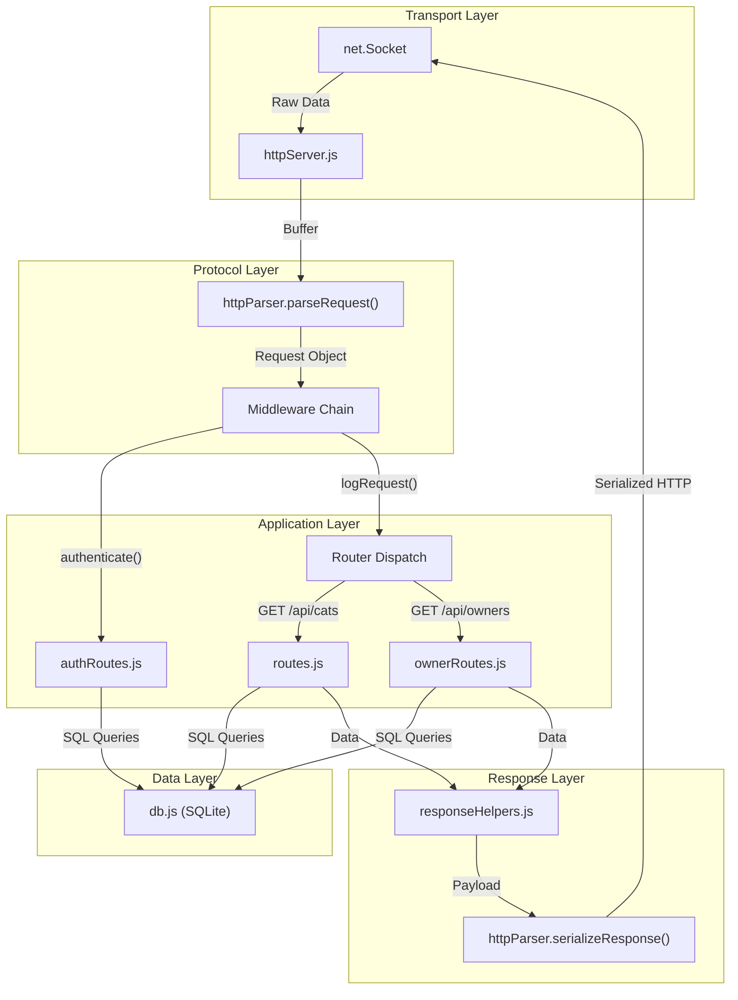
```mermaid
graph TD
    subgraph "Transport Layer"
        A["net.Socket"] -- "Raw Data" --> B["httpServer.js"]
    end

    subgraph "Protocol Layer"
        B -- "Buffer" --> C["httpParser.parseRequest()"]
        C -- "Request Object" --> D["Middleware Chain"]
    end

    subgraph "Application Layer"
        D -- "authenticate()" --> E["authRoutes.js"]
        D -- "logRequest()" --> F["Router Dispatch"]
        F -- "GET /api/cats" --> G["routes.js"]
        F -- "GET /api/owners" --> H["ownerRoutes.js"]
    end

    subgraph "Data Layer"
        G & H & E -- "SQL Queries" --> I["db.js (SQLite)"]
    end

    subgraph "Response Layer"
        G & H -- "Data" --> J["responseHelpers.js"]
        J -- "Payload" --> K["httpParser.serializeResponse()"]
        K -- "Serialized HTTP" --> A
    end
```
Sources: [README.md:67-90](), [src/server/httpServer.js:5-7](), [src/shared/httpParser.js:1-5]()

---

### Key Subsystems

The project is divided into several major subsystems, each detailed in its own documentation section.

#### 1. HTTP Engine
The engine consists of a custom parser (`httpParser.js`) and multiple server implementations. While the raw TCP server is the primary focus, the project includes a TLS-enabled version and an Express refactor for interoperability testing.
- **Raw TCP Server**: [src/server/httpServer.js:5-7]()
- **TLS Variant**: [src/server/httpServerTLS.js:1-10]()
- **Express Variant**: [src/server/httpServerExpress.js:1-10]()

#### 2. REST API & Persistence
The API layer handles CRUD operations for `Cats` and `Owners`. It features advanced functionality such as ETag-based caching, binary photo uploads, and session-based authentication.
- **Cats API**: [src/server/routes.js:1-20]()
- **Owners API**: [src/server/ownerRoutes.js:1-20]()
- **Auth API**: [src/server/authRoutes.js:1-15]()
- **Database**: [src/server/db.js:1-10]()

#### 3. Client Interfaces
The ecosystem provides three distinct ways to interact with the API:
- **CLI Client**: A terminal-based interactive tool [src/client/index.js:1-10]().
- **Browser GUI**: A single-page application for visual management [public/client.html:1-20]().
- **Quark REST Client**: A specialized GUI for testing raw HTTP requests [public/rest-client.html:1-20]().

#### 4. Minecraft Integration
A unique integration allows a `mineflayer` bot to interact with the cat shelter API, rendering cat photos as pixel art within a Minecraft server using the `tellraw` command [src/minecraft/minecraftBot.js:1-15]().

---

### Navigation Map

The following table maps system requirements to the documentation pages where they are covered in detail.

| Topic | Description | Link |
|-------|-------------|------|
| **Installation** | Prerequisites, `npm` scripts, and environment setup. | [Getting Started](#1.1) |
| **Project Layout** | File structure and directory responsibilities. | [Project Structure](#1.2) |
| **HTTP Protocol** | Parsing, serialization, and RFC 9112 details. | [Core HTTP Engine](#2) |
| **API Reference** | Endpoint documentation and authentication methods. | [API Layer](#3) |
| **Persistence** | SQLite schema and data models. | [Data Layer](#5) |
| **Minecraft Bot** | Pixel art rendering and bot commands. | [Minecraft Bot Integration](#7) |

**Code Entity Relationship Diagram**
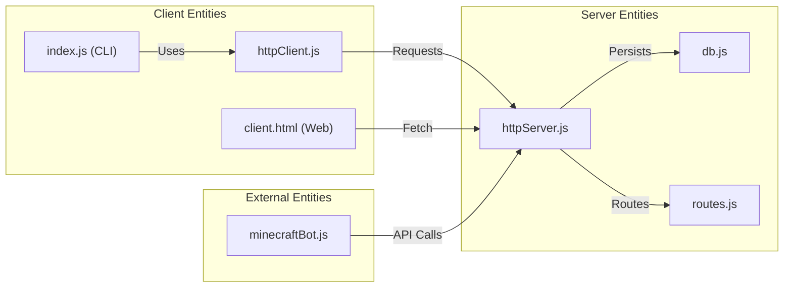
```mermaid
graph LR
    subgraph "Server Entities"
        S1["httpServer.js"]
        S2["db.js"]
        S3["routes.js"]
    end

    subgraph "Client Entities"
        C1["httpClient.js"]
        C2["index.js (CLI)"]
        C3["client.html (Web)"]
    end

    subgraph "External Entities"
        E1["minecraftBot.js"]
    end

    C1 -- "Requests" --> S1
    C2 -- "Uses" --> C1
    C3 -- "Fetch" --> S1
    E1 -- "API Calls" --> S1
    S1 -- "Persists" --> S2
    S1 -- "Routes" --> S3
```
Sources: [package.json:7-14](), [README.md:34-65]()

For setup instructions and running the server for the first time, see **[Getting Started](#1.1)**.
To understand where specific logic resides in the codebase, see **[Project Structure](#1.2)**.

---

# Page: Getting Started

# Getting Started

<details>
<summary>Relevant source files</summary>

The following files were used as context for generating this wiki page:

- [.github/workflows/ci.yml](.github/workflows/ci.yml)
- [package.json](package.json)
- [public/wiki.html](public/wiki.html)
- [scripts/generateCerts.js](scripts/generateCerts.js)

</details>


This page provides the necessary technical instructions to set up, configure, and run the `catsLibrary` system. It covers environment requirements, dependency management, security configuration via TLS, and the various operational modes of the server.

## Prerequisites

The project is built using modern JavaScript features and requires a stable Node.js environment.

*   **Node.js**: Version `>=18.0.0` is required [package.json:27-29]().
*   **OpenSSL**: Required for generating self-signed certificates for the TLS server mode [scripts/generateCerts.js:9-11]().

## Installation and Setup

To initialize the project, follow these steps:

1.  **Install Dependencies**: Run `npm install` to fetch required packages including `better-sqlite3` for persistence and `express` for the interoperability server [package.json:30-35]().
2.  **Generate TLS Certificates**: Execute the certificate generation script to enable HTTPS/TLS functionality.
    ```bash
    npm run gen-certs
    ```
    This script attempts to use `openssl` to create a 2048-bit RSA key and a self-signed certificate [scripts/generateCerts.js:28-35]().
3.  **Database Initialization**: The system uses an automatic lifecycle for the database. On the first server start, `initDb()` is called, which creates the five core tables (`owners`, `cats`, `users`, `sessions`, `api_keys`) and seeds them if empty [src/server/db.js:14-16]().

### Certificate Generation Logic
The following diagram illustrates the flow of the `generateCerts.js` script.

**Diagram: Certificate Generation Workflow**
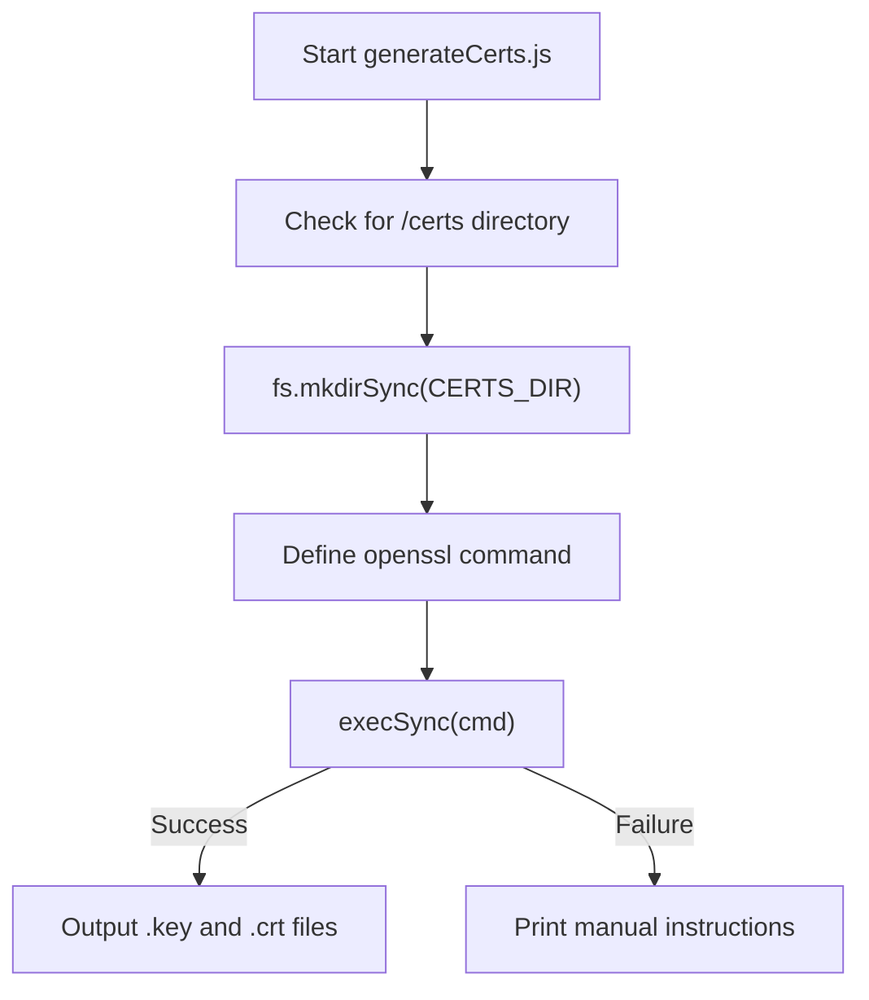
```mermaid
graph TD
    Start["Start generateCerts.js"] --> CheckDir["Check for /certs directory"]
    CheckDir --> CreateDir["fs.mkdirSync(CERTS_DIR)"]
    CreateDir --> DefineCmd["Define openssl command"]
    DefineCmd --> Exec["execSync(cmd)"]
    Exec -- "Success" --> Done["Output .key and .crt files"]
    Exec -- "Failure" --> Error["Print manual instructions"]
```
Sources: [scripts/generateCerts.js:19-58]()

## Running the Server

The `catsLibrary` project supports three distinct server modes, each accessible via specific `npm` scripts defined in `package.json` [package.json:6-9]().

| Script | Command | Description | Port |
| :--- | :--- | :--- | :--- |
| `npm start` | `node -e ... httpServer` | Runs the custom RFC 9112 compliant TCP server. | 3000 |
| `npm run start:tls` | `node -e ... httpServerTLS` | Runs the custom server with a TLS wrapper. | 3443 |
| `npm run start:express` | `node src/server/httpServerExpress.js` | Runs an Express.js version for comparison/testing. | 3001 |
| `npm run dev` | Same as `start` | Alias for the standard TCP server. | 3000 |

### Server Implementation Mapping
The project maps high-level server concepts to specific code entities within the `src/server` directory.

**Diagram: Server Entry Points and Core Entities**
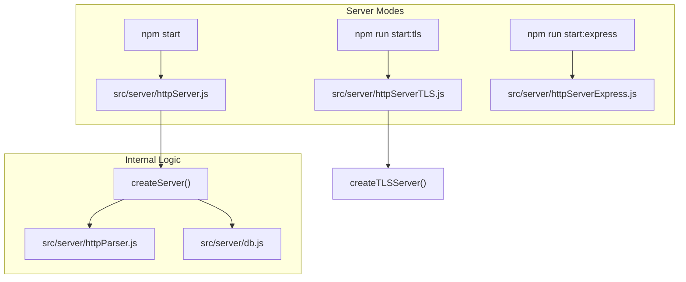
```mermaid
graph TD
    subgraph "Server Modes"
        TCP["npm start"] --> MainServer["src/server/httpServer.js"]
        TLS["npm run start:tls"] --> TLSServer["src/server/httpServerTLS.js"]
        EXP["npm run start:express"] --> ExpressServer["src/server/httpServerExpress.js"]
    end

    MainServer --> CreateSrv["createServer()"]
    TLSServer --> CreateTLS["createTLSServer()"]
    
    subgraph "Internal Logic"
        CreateSrv --> Proto["src/server/httpParser.js"]
        CreateSrv --> DB["src/server/db.js"]
    end
```
Sources: [package.json:7-9](), [src/server/httpServer.js:5-7](), [src/server/httpServerTLS.js:8-10]()

## Continuous Integration (CI)

The project utilizes GitHub Actions for automated testing and quality assurance. The CI pipeline is triggered on every push or pull request to the `main` or `master` branches [.github/workflows/ci.yml:3-7]().

### CI Pipeline Steps
1.  **Environment Setup**: Configures a matrix for Node.js versions 18.x and 20.x on `ubuntu-latest` [.github/workflows/ci.yml:11-15]().
2.  **Security Audit**: Runs `npm audit` to check for moderate or higher vulnerabilities [.github/workflows/ci.yml:28-29]().
3.  **Server Readiness**: Starts the server in the background and uses a `curl` polling loop (up to 10 attempts) to ensure the server is responding on port 3000 before proceeding [.github/workflows/ci.yml:32-38]().
4.  **Test Execution**: Runs the native Node.js test runner against `tests/api.test.js` [.github/workflows/ci.yml:39]().
5.  **Artifact Collection**: If a failure occurs, the pipeline uploads `logs/access.log` for debugging [.github/workflows/ci.yml:43-49]().

**Diagram: CI Pipeline Lifecycle**
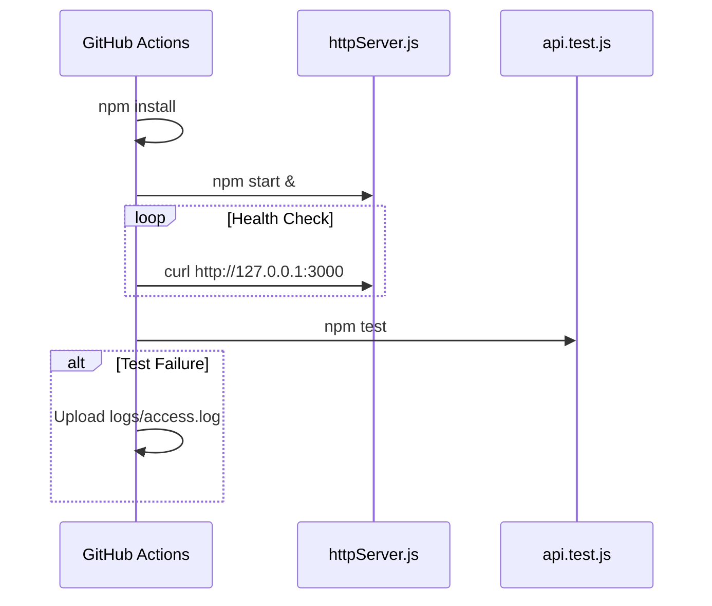
```mermaid
sequenceDiagram
    participant GH as GitHub Actions
    participant Srv as httpServer.js
    participant Test as api.test.js

    GH->>GH: npm install
    GH->>Srv: npm start &
    loop Health Check
        GH->>Srv: curl http://127.0.0.1:3000
    end
    GH->>Test: npm test
    alt Test Failure
        GH->>GH: Upload logs/access.log
    end
```
Sources: [.github/workflows/ci.yml:25-49]()

## Additional Tools

*   **CLI Client**: Run `npm run client` to launch the interactive terminal interface for managing cats and owners [package.json:10]().
*   **Minecraft Integration**: Run `npm run start:minecraft` to start the Mineflayer bot that connects the API to a Minecraft server [package.json:14]().

Sources: [package.json:1-36](), [.github/workflows/ci.yml:1-49](), [scripts/generateCerts.js:1-58](), [src/server/db.js:14-16]()

---

# Page: Project Structure

# Project Structure

<details>
<summary>Relevant source files</summary>

The following files were used as context for generating this wiki page:

- [LICENSE](LICENSE)
- [README.md](README.md)
- [package.json](package.json)
- [src/shared/httpParser.js](src/shared/httpParser.js)

</details>


This page provides a detailed overview of the `catsLibrary` directory layout and the functional role of its components. The project is architected as a monorepo containing a custom HTTP/1.1 engine, a RESTful API server, multiple client interfaces, and a Minecraft bot integration.

## Directory Layout Overview

The codebase is organized into functional domains, separating the core protocol implementation from the application logic and client interfaces.

| Directory | Purpose | Key Technologies |
|:---|:---|:---|
| `src/shared` | Core HTTP/1.1 logic used by both client and server. | Node.js `Buffer`, String manipulation |
| `src/server` | TCP/TLS server implementations, routing, and database. | `net`, `tls`, `better-sqlite3`, `crypto` |
| `src/client` | Raw TCP client library and interactive CLI. | `net`, `readline` |
| `src/minecraft` | Integration bot for Minecraft servers. | `mineflayer`, `jimp` |
| `public` | Static assets and browser-based GUI clients. | HTML, CSS, Vanilla JS |
| `tests` | Automated API and protocol testing. | `node:test` |
| `scripts` | Maintenance and setup utilities. | `node:crypto` |

**Sources:** [README.md:34-65](), [package.json:5-15]()

## Core System Architecture

The following diagram illustrates the relationship between the major code entities and how data flows from a raw TCP socket through the parsing and routing layers.

### Request Processing Pipeline
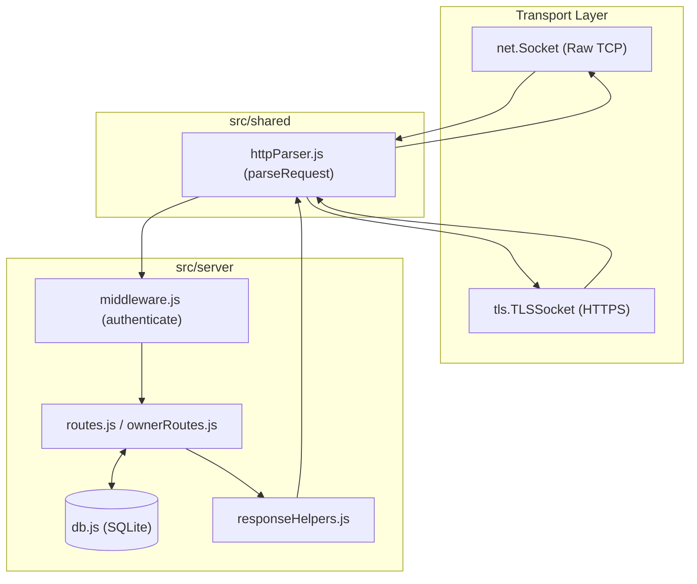
```mermaid
graph TD
    subgraph "Transport Layer"
        TCP["net.Socket (Raw TCP)"]
        TLS["tls.TLSSocket (HTTPS)"]
    end

    subgraph "src/shared"
        Parser["httpParser.js (parseRequest)"]
    end

    subgraph "src/server"
        Auth["middleware.js (authenticate)"]
        Router["routes.js / ownerRoutes.js"]
        DB[("db.js (SQLite)")]
        Helpers["responseHelpers.js"]
    end

    TCP --> Parser
    TLS --> Parser
    Parser --> Auth
    Auth --> Router
    Router <--> DB
    Router --> Helpers
    Helpers --> Parser
    Parser --> TCP
    Parser --> TLS
```
**Sources:** [README.md:67-90](), [src/shared/httpParser.js:25-56]()

## Detailed Component Breakdown

### 1. Server Components (`src/server/`)
The server layer manages persistence, security, and the request lifecycle.

*   **`httpServer.js`**: The entry point for the raw TCP server. It uses `net.createServer` to listen for connections and manages socket buffers [package.json:5-7]().
*   **`db.js`**: Handles SQLite initialization using `better-sqlite3`. It defines the schema for `cats`, `owners`, `users`, `sessions`, and `api_keys` [README.md:43]().
*   **`middleware.js`**: Implements the `authenticate()` function which resolves credentials via `X-API-Key`, `Authorization: Bearer`, or session cookies [README.md:133-142]().
*   **`responseHelpers.js`**: Provides `makeResponse` and ETag computation logic to ensure consistent API responses [README.md:48]().

### 2. Shared Protocol Layer (`src/shared/`)
This directory contains the logic for RFC 9112 compliance, shared between the server and the custom `httpClient.js`.

*   **`httpParser.js`**: Contains `parseRequest`, `parseResponse`, `serializeRequest`, and `serializeResponse` [src/shared/httpParser.js:25-163](). It handles CRLF framing and Chunked Transfer-Encoding via `encodeChunked` and `decodeChunked` [src/shared/httpParser.js:176-213]().

### 3. Client Interfaces (`src/client/` & `public/`)
The project provides three distinct ways to interact with the API.

*   **Raw TCP Client (`src/client/httpClient.js`)**: A custom implementation of an HTTP client using raw sockets, featuring a `CookieJar` for session management [README.md:52]().
*   **CLI (`src/client/index.js`)**: An interactive terminal interface for managing the shelter [package.json:10]().
*   **Browser GUIs (`public/`)**: 
    *   `client.html`: A standard management dashboard [README.md:56]().
    *   `rest-client.html`: A "Quark" inspired REST debugger for testing endpoints.

### 4. Minecraft Integration (`src/minecraft/`)
*   **`minecraftBot.js`**: A `mineflayer` bot that connects to Minecraft servers. It listens for chat commands like `!cat` and fetches data from the `httpServer.js` API to display cat info or pixel art in-game [package.json:14]().

## Code Entity Mapping

This diagram maps specific implementation functions and files to their logical roles in the system.

### Entity Relationship & Implementation Map
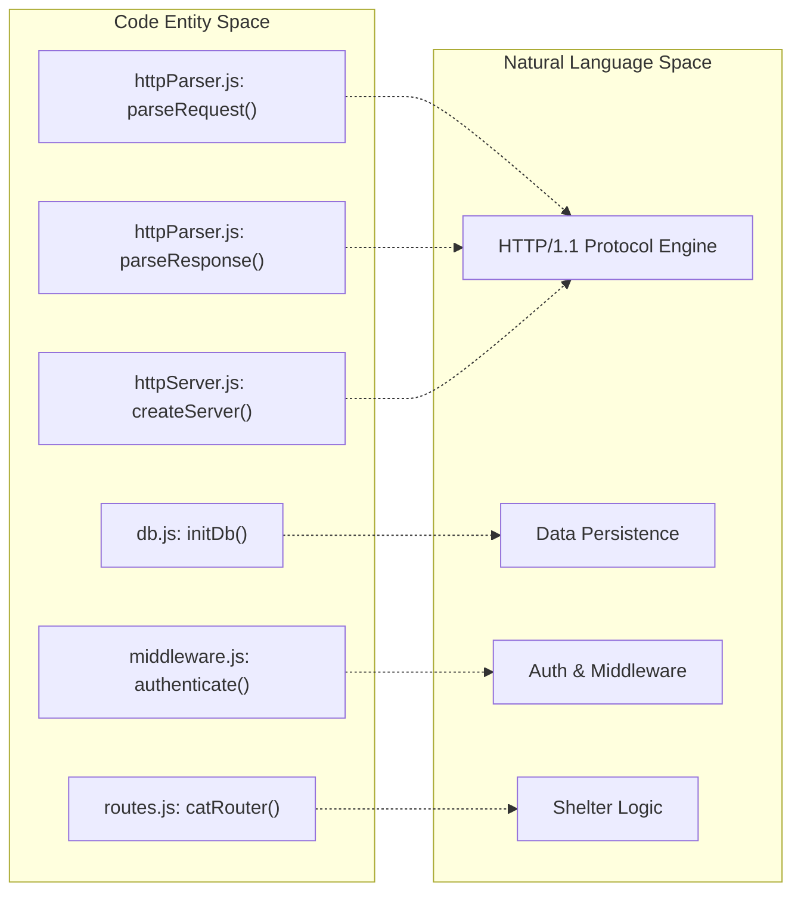
```mermaid
graph LR
    subgraph "Code Entity Space"
        P_REQ["httpParser.js: parseRequest()"]
        P_RES["httpParser.js: parseResponse()"]
        S_START["httpServer.js: createServer()"]
        D_INIT["db.js: initDb()"]
        M_AUTH["middleware.js: authenticate()"]
        R_CATS["routes.js: catRouter()"]
    end

    subgraph "Natural Language Space"
        Protocol["HTTP/1.1 Protocol Engine"]
        Persistence["Data Persistence"]
        Security["Auth & Middleware"]
        Business["Shelter Logic"]
    end

    P_REQ & P_RES -.-> Protocol
    S_START -.-> Protocol
    D_INIT -.-> Persistence
    M_AUTH -.-> Security
    R_CATS -.-> Business
```
**Sources:** [src/shared/httpParser.js:25-97](), [README.md:34-65](), [package.json:5-15]()

## Supporting Infrastructure

*   **`tests/api.test.js`**: A comprehensive test suite using the native `node --test` runner. It validates CRUD operations and protocol edge cases like ETag caching [package.json:11]().
*   **`scripts/generateCerts.js`**: A utility to generate self-signed certificates for the `httpServerTLS.js` variant [package.json:12]().
*   **`bruno/`**: Contains collection files for the Bruno API client, allowing for manual testing of the `auth`, `cats`, and `owners` routes.

**Sources:** [package.json:6-15](), [README.md:57-60]()

---

# Page: Core HTTP Engine

# Core HTTP Engine

<details>
<summary>Relevant source files</summary>

The following files were used as context for generating this wiki page:

- [src/server/httpServer.js](src/server/httpServer.js)
- [src/shared/httpParser.js](src/shared/httpParser.js)

</details>


The Core HTTP Engine is a custom, from-scratch implementation of the HTTP/1.1 protocol built directly on Node.js raw TCP sockets (`net.Socket`). By avoiding the native `http` module, the engine provides granular control over message framing, connection persistence, and binary data handling, ensuring strict adherence to RFC 9112.

### Architectural Overview

The engine follows a layered architecture where raw socket data is accumulated, parsed into structured objects, passed through a middleware and routing chain, and finally serialized back into wire-format strings or buffers.

#### System Flow: Socket to Route
This diagram illustrates how a raw TCP stream is transformed into a request object and dispatched through the server logic.

"TCP Stream to Request Dispatch"
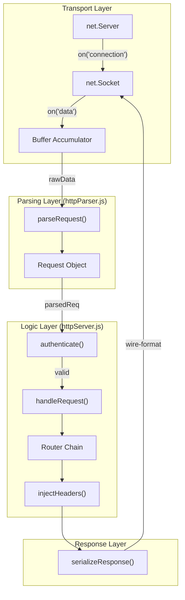
```mermaid
graph TD
    subgraph "Transport Layer"
        A["net.Server"] -- "on('connection')" --> B["net.Socket"]
        B -- "on('data')" --> C["Buffer Accumulator"]
    end

    subgraph "Parsing Layer (httpParser.js)"
        C -- "rawData" --> D["parseRequest()"]
        D --> E["Request Object"]
    end

    subgraph "Logic Layer (httpServer.js)"
        E -- "parsedReq" --> F["authenticate()"]
        F -- "valid" --> G["handleRequest()"]
        G --> H["Router Chain"]
        H --> I["injectHeaders()"]
    end

    subgraph "Response Layer"
        I --> J["serializeResponse()"]
        J -- "wire-format" --> B
    end
```
Sources: [src/server/httpServer.js:101-197](), [src/shared/httpParser.js:25-56]()

---

### Protocol Parsing (`httpParser.js`)

The parsing logic is encapsulated in a shared utility module that handles the transition between raw strings/buffers and JavaScript objects. It is designed to be binary-safe, supporting both standard UTF-8 text and raw image data.

*   **Request/Response Parsing**: Uses `CRLF_DOUBLE` (`\r\n\r\n`) as the delimiter between headers and body [src/shared/httpParser.js:14-29]().
*   **Chunked Transfer Encoding**: Implements RFC 9112 §7.1, allowing the server to stream large responses (above 4096 bytes) without pre-calculating `Content-Length` [src/shared/httpParser.js:165-190]().
*   **Header Normalization**: Automatically converts header keys to lowercase for consistent lookups [src/shared/httpParser.js:115-115]().

For a deep dive into the parsing mechanics and serialization, see [HTTP Parser (httpParser.js)](#2.1).

Sources: [src/shared/httpParser.js:1-163](), [src/server/httpServer.js:37-37]()

---

### The Raw TCP Server (`httpServer.js`)

The `httpServer.js` module contains the core `createServer` factory. It manages the lifecycle of TCP connections, including socket timeouts and the `Connection: keep-alive` mechanism required for HTTP/1.1 compliance.

*   **Socket Management**: Tracks active sockets and implements a `KEEP_ALIVE_TIMEOUT_MS` of 30 seconds [src/server/httpServer.js:36-36]().
*   **Static File Serving**: Serves assets from the `/public` directory with built-in path-traversal prevention by validating that resolved paths remain within `PUBLIC_DIR` [src/server/httpServer.js:66-81]().
*   **Header Injection**: A unique `injectHeaders` function allows the server to append mandatory headers (like `CORS` or `Connection`) to responses that have already been serialized by sub-routers [src/server/httpServer.js:203-215]().

For details on connection handling and the request lifecycle, see [Raw TCP Server (httpServer.js)](#2.2).

Sources: [src/server/httpServer.js:1-215]()

---

### TLS and Express Variants

While the raw TCP server is the primary engine, the codebase provides two alternative implementations for security and interoperability testing.

*   **TLS Server**: Located in `httpServerTLS.js`, this variant wraps the same logic in `tls.createServer` to provide HTTPS support on port 3443.
*   **Express Variant**: Located in `httpServerExpress.js`, this implementation uses the industry-standard Express framework on port 3001. It serves as a benchmark for the custom engine's behavior and ensures the API logic is portable.

#### Entity Mapping: Server Variants
This diagram maps the different server entry points to their underlying Node.js modules and specific file implementations.

"Server Implementation Mapping"
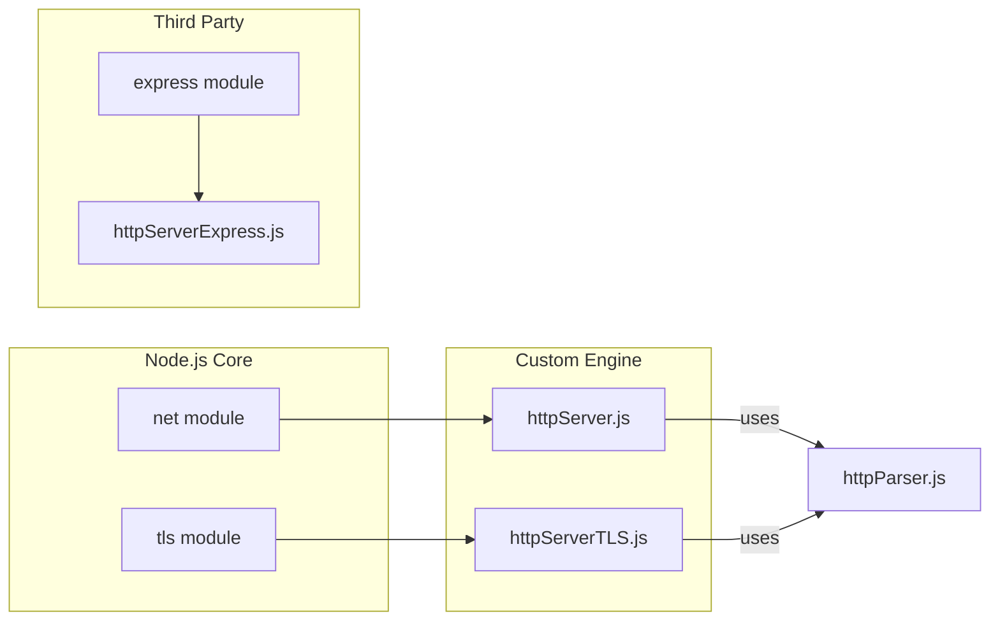
```mermaid
graph LR
    subgraph "Node.js Core"
        NET["net module"]
        TLS["tls module"]
    end

    subgraph "Custom Engine"
        TCP_S["httpServer.js"]
        TLS_S["httpServerTLS.js"]
    end

    subgraph "Third Party"
        EXP["express module"]
        EXP_S["httpServerExpress.js"]
    end

    NET --> TCP_S
    TLS --> TLS_S
    EXP --> EXP_S

    TCP_S -- "uses" --> P["httpParser.js"]
    TLS_S -- "uses" --> P
```
Sources: [src/server/httpServer.js:17-21](), [src/server/httpServerTLS.js:1-20](), [src/server/httpServerExpress.js:1-15]()

For more information on these variants, see [TLS Server & Express Variant](#2.3).

---

# Page: HTTP Parser (httpParser.js)

# HTTP Parser (httpParser.js)

<details>
<summary>Relevant source files</summary>

The following files were used as context for generating this wiki page:

- [src/shared/httpParser.js](src/shared/httpParser.js)

</details>


The `httpParser.js` module is a core utility in the `catsLibrary` project, providing RFC 9112-compliant logic for parsing and serializing HTTP/1.1 messages. Because the project avoids Node.js's built-in `http` module to demonstrate raw TCP socket management, this utility serves as the protocol engine for both the server-side request handling and the client-side response processing [src/shared/httpParser.js:1-9]().

## Core Logic and RFC 9112 Compliance

The parser is designed to handle the fundamental components of the HTTP/1.1 protocol, including CRLF (`\r\n`) line endings, header normalization, and message framing via `Content-Length` or `Transfer-Encoding: chunked` [src/shared/httpParser.js:13-15]().

### Message Parsing Flow

The parsing functions (`parseRequest` and `parseResponse`) follow a strict sequence to decompose raw strings into structured JavaScript objects.

1.  **Separation**: Locates the `\r\n\r\n` (double CRLF) sequence to split the header section from the body [src/shared/httpParser.js:26-32]().
2.  **Start Line Analysis**:
    *   For requests: Extracts the `method`, `path`, and `httpVersion` [src/shared/httpParser.js:38-47]().
    *   For responses: Extracts the `httpVersion`, `statusCode`, and `statusText` [src/shared/httpParser.js:79-83]().
3.  **Header Normalization**: Converts all header keys to lowercase and handles multi-value headers (like `Set-Cookie`) by aggregating them into arrays [src/shared/httpParser.js:109-124]().
4.  **Body Decoding**: If the `Transfer-Encoding` header contains `chunked`, the body is passed through `decodeChunked` [src/shared/httpParser.js:51-53]().

### Entity Association: Parser Data Flow

The following diagram illustrates how raw network data is transformed into code entities used by the rest of the application.

**Diagram: Request Parsing Data Flow**
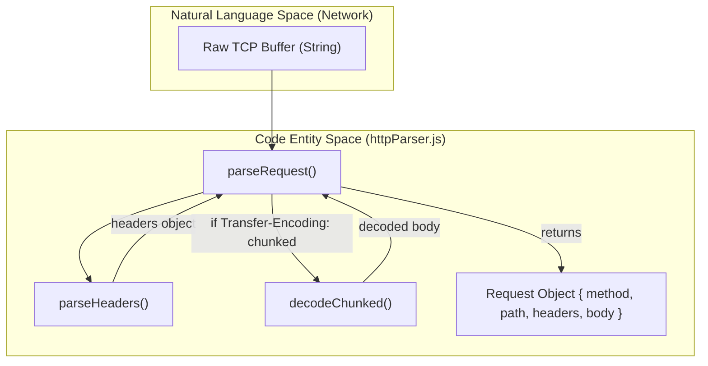
```mermaid
graph TD
    subgraph "Natural Language Space (Network)"
        RAW["Raw TCP Buffer (String)"]
    end

    subgraph "Code Entity Space (httpParser.js)"
        PR["parseRequest()"]
        PH["parseHeaders()"]
        DC["decodeChunked()"]
        
        RAW --> PR
        PR --> PH
        PH -->|"headers object"| PR
        PR -->|"if Transfer-Encoding: chunked"| DC
        DC -->|"decoded body"| PR
        
        PR -->|"returns"| REQ_OBJ["Request Object { method, path, headers, body }"]
    end
```
**Sources:** [src/shared/httpParser.js:25-56](), [src/shared/httpParser.js:109-124](), [src/shared/httpParser.js:197-214]()

---

## Function Reference

### Parsing Functions

| Function | Purpose | Key Logic |
| :--- | :--- | :--- |
| `parseRequest(rawRequest)` | Converts a raw HTTP string into a request object. | Validates the request-line format (RFC 9112 §3.1) [src/shared/httpParser.js:25-56](). |
| `parseResponse(rawResponse)` | Converts a raw HTTP string into a response object. | Parses the status-line and handles numeric status codes [src/shared/httpParser.js:66-97](). |
| `parseHeaders(lines)` | Transforms an array of header lines into a key-value map. | Lowercases keys; converts duplicates into arrays [src/shared/httpParser.js:109-124](). |

### Serialization Functions

| Function | Purpose | Key Logic |
| :--- | :--- | :--- |
| `serializeRequest(req)` | Formats a request object for network transmission. | Constructs the request-line and appends headers/body [src/shared/httpParser.js:133-137](). |
| `serializeResponse(res)` | Formats a response object for network transmission. | Supports optional `chunked: true` to trigger auto-encoding [src/shared/httpParser.js:148-163](). |

**Sources:** [src/shared/httpParser.js:25-163]()

---

## Chunked Transfer Encoding

The library implements RFC 9112 §7.1 for handling large payloads or streaming data.

### Encoding (`encodeChunked`)
When a response is marked as `chunked`, the body is split into 1024-byte segments [src/shared/httpParser.js:167](). Each segment is preceded by its size in hexadecimal and followed by a CRLF. The stream is terminated with a `0\r\n\r\n` (the last-chunk) [src/shared/httpParser.js:176-190]().

### Decoding (`decodeChunked`)
The decoder iterates through the chunked body, reading the hex size, extracting the specified number of bytes, and skipping the trailing CRLF until the `0` size chunk is encountered [src/shared/httpParser.js:197-214]().

**Diagram: Serialization Logic**
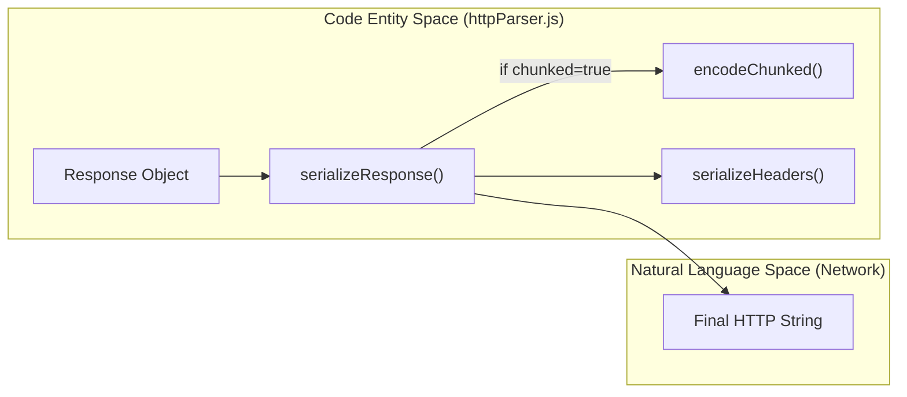
```mermaid
graph LR
    subgraph "Code Entity Space (httpParser.js)"
        SR["serializeResponse()"]
        EC["encodeChunked()"]
        SH["serializeHeaders()"]
        
        OBJ["Response Object"] --> SR
        SR -->|"if chunked=true"| EC
        SR --> SH
    end

    subgraph "Natural Language Space (Network)"
        STR["Final HTTP String"]
        SR --> STR
    end
```
**Sources:** [src/shared/httpParser.js:148-163](), [src/shared/httpParser.js:176-190]()

---

## Binary Safety and Buffer Handling

While the parser frequently operates on strings for header manipulation, it maintains binary safety for the message body by utilizing Node.js `Buffer` objects where necessary.

*   **Encoding**: `encodeChunked` converts the body to a `Buffer` using `utf8` before slicing it into chunks to ensure that multi-byte characters are not split incorrectly [src/shared/httpParser.js:179-183]().
*   **Delimiters**: The parser relies on the constant `CRLF_DOUBLE` (`\r\n\r\n`) to identify the boundary between metadata (headers) and payload (body), ensuring that binary data in the body does not interfere with header parsing [src/shared/httpParser.js:14-26]().

**Sources:** [src/shared/httpParser.js:13-15](), [src/shared/httpParser.js:26-32](), [src/shared/httpParser.js:179-183]()

---

# Page: Raw TCP Server (httpServer.js)

# Raw TCP Server (httpServer.js)

<details>
<summary>Relevant source files</summary>

The following files were used as context for generating this wiki page:

- [src/server/httpServer.js](src/server/httpServer.js)
- [src/server/responseHelpers.js](src/server/responseHelpers.js)
- [tests/api.test.js](tests/api.test.js)

</details>


The `httpServer.js` module implements a custom HTTP/1.1 server built directly on Node.js raw TCP sockets (`net.Module`). It eschews the built-in `http` module to provide a transparent implementation of RFC 9112, handling everything from socket-level buffer accumulation to application-level routing and static file serving.

## Core Implementation Logic

The server operates by listening for TCP connections and managing the lifecycle of each socket. It supports persistent connections via `keep-alive` and utilizes a middleware-inspired chain for request processing.

### Request Lifecycle

1.  **Connection**: A client connects to the configured port.
2.  **Data Accumulation**: The server listens for `data` events on the socket, accumulating chunks into a buffer until a complete HTTP request is detected [src/server/httpServer.js:246-258]().
3.  **Parsing**: The `handleRequest` function calls `parseRequest` to transform the raw buffer into a structured object [src/server/httpServer.js:101-105]().
4.  **Middleware & Auth**: The request passes through `authenticate()` to verify credentials (API Keys, Session Tokens, or Cookies) [src/server/httpServer.js:136-137]().
5.  **Routing**: The request is dispatched through a series of routers (Auth, Cats, Owners, Proxy, and Static) [src/server/httpServer.js:156-167]().
6.  **Serialization & Response**: The resulting data is serialized, headers are injected (CORS, Connection), and the string is written back to the socket [src/server/httpServer.js:170-178]().

### Connection Management Diagram
The following diagram illustrates the flow from a raw TCP socket event to the high-level `handleRequest` logic.

**TCP Socket to Request Handler Flow**
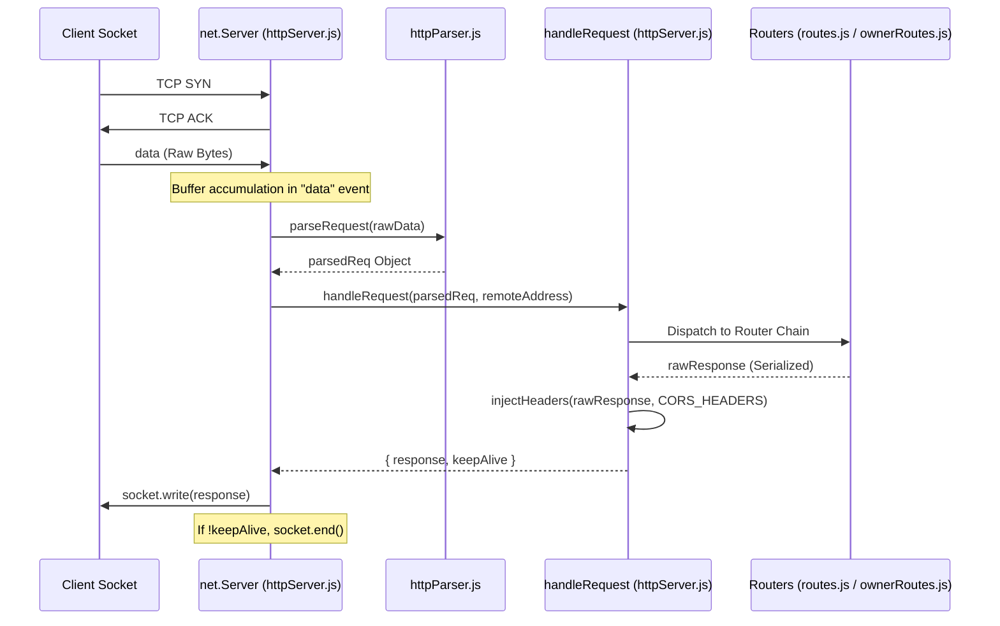
```mermaid
sequenceDiagram
    participant C as Client Socket
    participant S as net.Server (httpServer.js)
    participant P as httpParser.js
    participant H as handleRequest (httpServer.js)
    participant R as Routers (routes.js / ownerRoutes.js)

    C->>S: TCP SYN
    S->>C: TCP ACK
    C->>S: data (Raw Bytes)
    Note over S: Buffer accumulation in "data" event
    S->>P: parseRequest(rawData)
    P-->>S: parsedReq Object
    S->>H: handleRequest(parsedReq, remoteAddress)
    H->>R: Dispatch to Router Chain
    R-->>H: rawResponse (Serialized)
    H->>H: injectHeaders(rawResponse, CORS_HEADERS)
    H-->>S: { response, keepAlive }
    S->>C: socket.write(response)
    Note over S: If !keepAlive, socket.end()
```
**Sources:** [src/server/httpServer.js:101-197](), [src/server/httpServer.js:246-278]()

---

## Static File Serving & Security

The server includes a built-in static file server to serve assets from the `/public` directory (e.g., `index.html`, `client.js`).

### Path Traversal Prevention
To comply with security standards (RFC 9110 §2.7.1), the `serveStaticFile` function validates that the resolved file path remains within the `PUBLIC_DIR` boundaries [src/server/httpServer.js:72-80]().

| Feature | Implementation |
| :--- | :--- |
| **Root Path** | Maps `/` to `index.html` [src/server/httpServer.js:67-70](). |
| **MIME Mapping** | Uses `MIME_TYPES` lookup table for extensions like `.js`, `.css`, `.png` [src/server/httpServer.js:41-53](). |
| **Binary Safety** | Files are read using `fs.readFileSync` and converted to `binary` strings for safe transmission [src/server/httpServer.js:85-95](). |
| **CORS** | Injects `Access-Control-Allow-Origin: *` to allow the GUI to interact with the API [src/server/httpServer.js:57-62](). |

**Sources:** [src/server/httpServer.js:39-97]()

---

## Header Injection Pattern

Because the router modules often return fully serialized HTTP response strings (via `responseHelpers.js`), the main server uses a "late-injection" pattern to add connection-level headers without re-parsing the entire response.

The `injectHeaders` function identifies the boundary between headers and the body (`\r\n\r\n`) and splices in new header lines [src/server/httpServer.js:203-215]().

**Header Injection Entity Mapping**
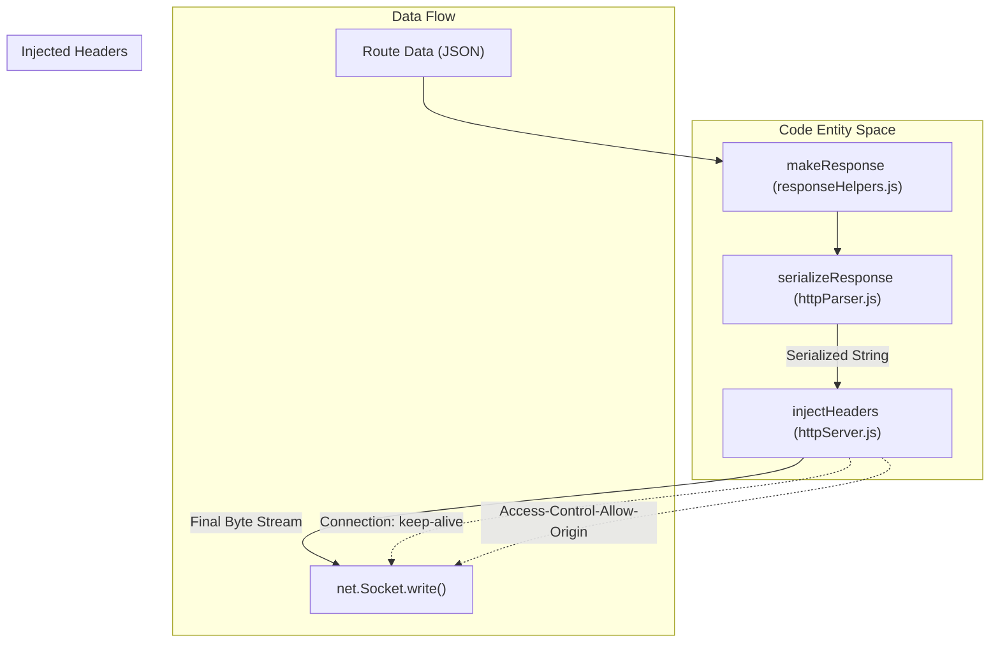
```mermaid
graph TD
    subgraph "Code Entity Space"
        RH["makeResponse (responseHelpers.js)"]
        IH["injectHeaders (httpServer.js)"]
        SR["serializeResponse (httpParser.js)"]
    end

    subgraph "Data Flow"
        Data["Route Data (JSON)"] --> RH
        RH --> SR
        SR -->|"Serialized String"| IH
        IH -->|"Final Byte Stream"| Socket["net.Socket.write()"]
    end

    subgraph "Injected Headers"
        IH -.->|"Connection: keep-alive"| Socket
        IH -.->|"Access-Control-Allow-Origin"| Socket
    end
```
**Sources:** [src/server/httpServer.js:203-215](), [src/server/responseHelpers.js:24-42]()

---

## Keep-Alive & Timeout Logic

The server implements HTTP/1.1 persistent connections to reduce latency.

*   **Detection**: The server checks the `Connection` header. If it is not explicitly `close`, `keepAlive` is assumed true [src/server/httpServer.js:130-133]().
*   **Idle Timeout**: Sockets are configured with a `KEEP_ALIVE_TIMEOUT_MS` (30 seconds). If no data is received within this window, the socket is destroyed to free resources [src/server/httpServer.js:36](), [src/server/httpServer.js:237-240]().
*   **Lifecycle Control**: In the `data` event handler, if `keepAlive` is false after a request is processed, `socket.end()` is called immediately after `socket.write()` [src/server/httpServer.js:272-274]().

## Factory Function: `createServer`

The server is instantiated via a factory function that returns a standard `net.Server` object.

```javascript
// Example usage (Internal)
const server = createServer({ port: 3000, host: '0.0.0.0' });
```

The factory sets up the `connection` listener, handles socket errors to prevent process crashes, and initializes the buffer state for every new client [src/server/httpServer.js:227-285]().

**Sources:** [src/server/httpServer.js:36](), [src/server/httpServer.js:220-285]()

---

# Page: TLS Server & Express Variant

# TLS Server & Express Variant

<details>
<summary>Relevant source files</summary>

The following files were used as context for generating this wiki page:

- [public/wiki.html](public/wiki.html)
- [scripts/generateCerts.js](scripts/generateCerts.js)
- [src/server/httpServerExpress.js](src/server/httpServerExpress.js)
- [src/server/httpServerTLS.js](src/server/httpServerTLS.js)

</details>


This page covers the two alternative server implementations provided in the `catsLibrary` project: the native TLS-wrapped TCP server and the Express-based interoperability variant. While the core project focuses on a raw TCP implementation of HTTP/1.1, these variants provide encrypted transport and a standard framework reference for testing.

## TLS Server (httpServerTLS.js)

The `httpServerTLS.js` module implements a secure version of the custom HTTP/1.1 engine. It swaps the transport layer from `net.createServer` to `tls.createServer` while retaining the exact same request handling logic, protocol parsing, and routing as the raw TCP server `[src/server/httpServerTLS.js:11-13]()`.

### Implementation Details
The server operates on port **3443** by default `[src/server/httpServerTLS.js:150-150]()`. It uses Node.js's built-in `tls` module to handle the handshake and encryption.

*   **Certificate Loading**: The server requires a `server.crt` and `server.key` located in the `certs/` directory `[src/server/httpServerTLS.js:151-152]()`. If missing, it throws an error directing the user to the generation script `[src/server/httpServerTLS.js:154-159]()`.
*   **Buffer Accumulation**: Like the raw server, it accumulates data in a string buffer using `binary` encoding to ensure byte-integrity for binary payloads (like cat photos) `[src/server/httpServerTLS.js:173-173]()`.
*   **Request Lifecycle**: It waits for the `\r\n\r\n` delimiter and validates the `Content-Length` before passing the buffer to `handleRequest` `[src/server/httpServerTLS.js:174-182]()`.

### Data Flow: TLS Request Handling

The following diagram illustrates how a secure request moves from the encrypted socket through the shared routing logic.

**TLS Request Processing Flow**
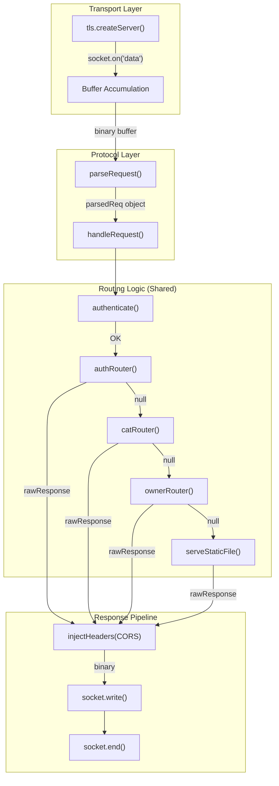
```mermaid
graph TD
    subgraph "Transport Layer"
        A["tls.createServer()"] -- "socket.on('data')" --> B["Buffer Accumulation"]
    end

    subgraph "Protocol Layer"
        B -- "binary buffer" --> C["parseRequest()"]
        C -- "parsedReq object" --> D["handleRequest()"]
    end

    subgraph "Routing Logic (Shared)"
        D --> E["authenticate()"]
        E -- "OK" --> F["authRouter()"]
        F -- "null" --> G["catRouter()"]
        G -- "null" --> H["ownerRouter()"]
        H -- "null" --> I["serveStaticFile()"]
    end

    subgraph "Response Pipeline"
        F & G & H & I -- "rawResponse" --> J["injectHeaders(CORS)"]
        J -- "binary" --> K["socket.write()"]
        K --> L["socket.end()"]
    end
```
**Sources:** `[src/server/httpServerTLS.js:88-146]()`, `[src/server/httpServerTLS.js:166-186]()`

## Express Variant (httpServerExpress.js)

The `httpServerExpress.js` module provides a standard `express` implementation of the same API. This variant is primarily used for interoperability testing and to verify that the custom HTTP parser in the main server behaves identically to a production-grade framework.

### Key Characteristics
*   **Port**: Defaults to **3001** `[src/server/httpServerExpress.js:157-157]()`.
*   **Middleware**: Uses standard `express.json()` for body parsing `[src/server/httpServerExpress.js:19-19]()` and `express.static()` for the `public/` folder `[src/server/httpServerExpress.js:68-68]()`.
*   **Shared Logic**: It imports `isValidApiKey` and `validateToken` from the core project to ensure authentication parity `[src/server/httpServerExpress.js:15-16]()`.

### Comparison of Routing Implementations

| Feature | `httpServerTLS.js` (Custom) | `httpServerExpress.js` (Express) |
| :--- | :--- | :--- |
| **Parsing** | `parseRequest` (Custom) `[src/server/httpParser.js:16-16]()` | `express.json()` `[src/server/httpServerExpress.js:19-19]()` |
| **Routing** | Manual Dispatch (Router functions) `[src/server/httpServerTLS.js:122-125]()` | `app.get()`, `app.post()`, etc. `[src/server/httpServerExpress.js:108-149]()` |
| **Auth** | `authenticate` middleware `[src/server/httpServerTLS.js:106-106]()` | `requireAuth` middleware `[src/server/httpServerExpress.js:35-54]()` |
| **Persistence** | SQLite (via `routes.js`) | SQLite (Direct `db.prepare` calls) `[src/server/httpServerExpress.js:109-109]()` |

**Sources:** `[src/server/httpServerTLS.js:106-125]()`, `[src/server/httpServerExpress.js:35-153]()`

## Certificate Generation (generateCerts.js)

To support the TLS server, the `scripts/generateCerts.js` utility automates the creation of self-signed certificates.

*   **Mechanism**: It attempts to shell out to `openssl` to generate a 2048-bit RSA key and a self-signed X.509 certificate `[scripts/generateCerts.js:28-35]()`.
*   **Output**: Files are written to `certs/server.key` and `certs/server.crt` `[scripts/generateCerts.js:20-21]()`.
*   **Subject**: The certificate is issued to `CN=localhost` `[scripts/generateCerts.js:27-27]()`.

**Sources:** `[scripts/generateCerts.js:19-58]()`

## Entity Mapping: Code to System

This diagram maps the logical server components to their specific code entities across both the TLS and Express variants.

**Component to Entity Mapping**
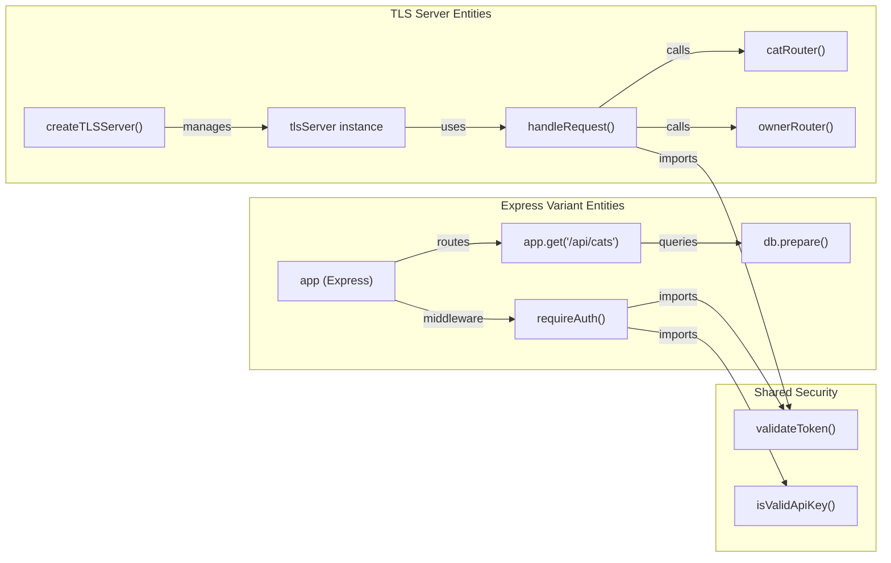
```mermaid
graph LR
    subgraph "TLS Server Entities"
        T1["createTLSServer()"] -- "manages" --> T2["tlsServer instance"]
        T2 -- "uses" --> T3["handleRequest()"]
        T3 -- "calls" --> T4["catRouter()"]
        T3 -- "calls" --> T5["ownerRouter()"]
    end

    subgraph "Express Variant Entities"
        E1["app (Express)"] -- "routes" --> E2["app.get('/api/cats')"]
        E1 -- "middleware" --> E3["requireAuth()"]
        E2 -- "queries" --> E4["db.prepare()"]
    end

    subgraph "Shared Security"
        S1["validateToken()"]
        S2["isValidApiKey()"]
    end

    T3 -- "imports" --> S1
    E3 -- "imports" --> S1
    E3 -- "imports" --> S2
```
**Sources:** `[src/server/httpServerTLS.js:21-25]()`, `[src/server/httpServerTLS.js:150-216]()`, `[src/server/httpServerExpress.js:15-16]()`, `[src/server/httpServerExpress.js:35-54]()`

---

# Page: API Layer

# API Layer

<details>
<summary>Relevant source files</summary>

The following files were used as context for generating this wiki page:

- [public/index.html](public/index.html)
- [src/server/authRoutes.js](src/server/authRoutes.js)
- [src/server/ownerRoutes.js](src/server/ownerRoutes.js)
- [src/server/routes.js](src/server/routes.js)

</details>


The API Layer provides a RESTful interface for managing the cat shelter's resources. It is composed of modular routers that handle specific domains: cats, owners, authentication, and a specialized proxy for cross-origin client support. These routers are integrated into the main request lifecycle to dispatch logic based on the HTTP method and URL path [src/server/routes.js:226-235]().

### API Architecture Overview

The server uses a functional routing approach where each router receives a `parsedReq` object and returns a serialized HTTP response string [src/server/routes.js:226-248]().

#### System to Code Mapping
The following diagram maps high-level API domains to their implementing files and primary router functions.

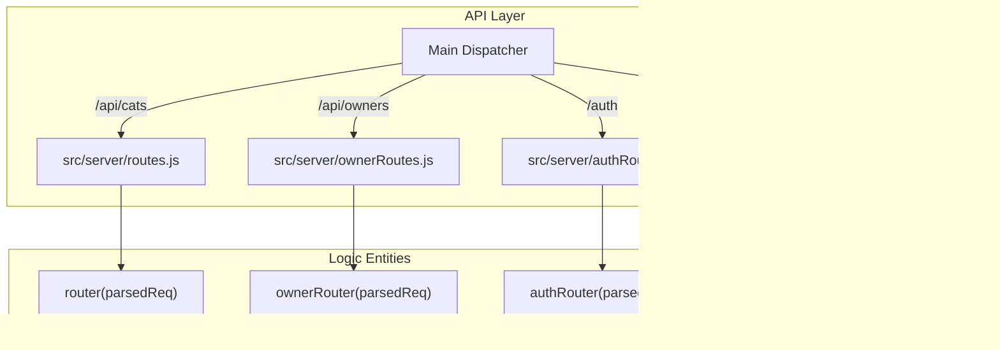
```mermaid
graph TD
    subgraph "API Layer"
        Router["Main Dispatcher"]
        
        Router -->|"/api/cats"| Cats["src/server/routes.js"]
        Router -->|"/api/owners"| Owners["src/server/ownerRoutes.js"]
        Router -->|"/auth"| Auth["src/server/authRoutes.js"]
        Router -->|"/api/proxy"| Proxy["src/server/proxyRoutes.js"]
    end

    subgraph "Logic Entities"
        Cats --> handler1["router(parsedReq)"]
        Owners --> handler2["ownerRouter(parsedReq)"]
        Auth --> handler3["authRouter(parsedReq)"]
    end
```
Sources: [src/server/routes.js:226-227](), [src/server/ownerRoutes.js:150-151](), [src/server/authRoutes.js:160-161]()

---

### 🐱 Cats API
The Cats API handles the core business logic for feline management. It supports standard CRUD operations and includes specialized logic for multimedia handling (binary and Base64 photos) and ID gap-filling during creation [src/server/routes.js:24-32]().

**Key Features:**
- **ID Management**: Reuses IDs from deleted records using `getNextCatId` [src/server/routes.js:24-32]().
- **Multimedia**: Supports photo uploads via raw binary buffers or Data URLs [src/server/routes.js:159-187]().
- **Caching**: Implements ETag-based validation for collection and resource GET requests [src/server/routes.js:41-43]().

For details, see [Cats API (routes.js)](#3.1).

---

### 👥 Owners API
The Owners API manages shelter contributors and their relationships to cats. It features a "hydrated" data model where owner objects automatically include an array of their assigned cats [src/server/ownerRoutes.js:28-31]().

**Key Features:**
- **Relationships**: Endpoints for assigning (`POST`) or unassigning (`DELETE`) cats to owners [src/server/ownerRoutes.js:125-146]().
- **Data Integrity**: Enforces unique email constraints and handles SQLite `FOREIGN KEY` behaviors [src/server/ownerRoutes.js:77-84]().
- **Hydration**: The `ownerWithCats` helper merges data from the `owners` and `cats` tables into a single JSON response [src/server/ownerRoutes.js:28-31]().

For details, see [Owners API (ownerRoutes.js)](#3.2).

---

### 🔐 Authentication API
The Authentication API manages user identity and session state. It does not use external libraries for security, relying instead on Node.js `crypto` for password hashing and token generation [src/server/authRoutes.js:23-28]().

**Key Features:**
- **Security**: Uses `PBKDF2-SHA256` for password hashing with unique salts [src/server/authRoutes.js:15-18]().
- **Session Management**: Issues 32-byte hex tokens stored in the `sessions` table with a 1-hour expiry [src/server/authRoutes.js:19-53]().
- **Stateful Auth**: Supports `Set-Cookie` for browser clients and `X-Session-Token` for CLI/Quark clients [src/server/authRoutes.js:134-166]().

For details, see [Authentication API (authRoutes.js)](#3.3).

---

### 🌐 Proxy Route
The Proxy API is a utility endpoint designed specifically for the Quark REST client (a browser-based SPA). It allows the client to bypass Browser CORS restrictions by relaying requests through the shelter server [public/rest-client.html:246-250]().

**Key Features:**
- **Request Relay**: Forwards methods, headers, and bodies to target URLs.
- **Sanitization**: Filters sensitive headers to prevent loopbacks or security leaks.
- **Binary Handling**: Correctly pipes binary data for photo transfers through the proxy.

For details, see [Proxy Route (proxyRoutes.js)](#3.4).

---

### API Route Summary

| Method | Path | Router | Description |
| :--- | :--- | :--- | :--- |
| `GET` | `/api/cats` | `routes.js` | List all cats [src/server/routes.js:37]() |
| `POST` | `/api/cats/:id/photo` | `routes.js` | Upload cat photo [src/server/routes.js:159]() |
| `GET` | `/api/owners` | `ownerRoutes.js` | List owners + cats [src/server/ownerRoutes.js:45]() |
| `POST` | `/api/owners/:o/cats/:c` | `ownerRoutes.js` | Assign cat to owner [src/server/ownerRoutes.js:125]() |
| `POST` | `/auth/login` | `authRoutes.js` | User login [src/server/authRoutes.js:105]() |
| `GET` | `/auth/me` | `authRoutes.js` | Get current session [src/server/authRoutes.js:148]() |

Sources: [src/server/routes.js:226-248](), [src/server/ownerRoutes.js:150-185](), [src/server/authRoutes.js:160-174]()

---

# Page: Cats API (routes.js)

# Cats API (routes.js)

<details>
<summary>Relevant source files</summary>

The following files were used as context for generating this wiki page:

- [src/server/responseHelpers.js](src/server/responseHelpers.js)
- [src/server/routes.js](src/server/routes.js)
- [tests/api.test.js](tests/api.test.js)

</details>


The Cats API provides a RESTful interface for managing cat resources within the shelter system. It handles standard CRUD operations, complex photo management (supporting both binary and Data URL uploads), and implements performance optimizations such as ETag-based caching and ID gap-filling.

### Architectural Overview

The API is structured as a dispatch router that maps incoming HTTP requests to specific handler functions. These handlers interact with the SQLite database via `db.js` and utilize `responseHelpers.js` to standardize HTTP responses according to RFC 9110 and RFC 9112.

#### Data Flow: Request to Response
The following diagram illustrates how a request for a cat resource is processed through the system entities.

**Diagram: Cat Request Lifecycle**
```mermaid
graph TD
    subgraph "Natural Language Space"
        "User wants to see a cat" --> "Request /api/cats/:id"
    end

    subgraph "Code Entity Space"
        "Request /api/cats/:id" --> R["router() in src/server/routes.js"]
        R --> G["getCatById()"]
        G --> DB["db.prepare().get()"]
        DB --> P["computeETag()"]
        P --> CH["isCacheHit()"]
        CH -- "Match" --> NM["makeNotModified()"]
        CH -- "No Match" --> MR["makeResponse()"]
        MR --> S["serializeResponse()"]
    end
```
**Sources:** [src/server/routes.js:226-235](), [src/server/routes.js:48-71](), [src/server/responseHelpers.js:98-114]()

---

### Core Functionality

#### ID Management (Gap-Filling)
Unlike standard auto-incrementing sequences, the Cats API implements a gap-filling logic for IDs. When a new cat is created, the system identifies the lowest available integer starting from 1. This ensures that IDs released by deletions are reused, maintaining a compact ID space.

*   **Function:** `getNextCatId()` [src/server/routes.js:24-32]()
*   **Logic:** Selects all IDs ordered ascending, iterates from 1, and returns the first missing integer.

#### CRUD Endpoints
| Method | Endpoint | Description | Status Codes |
| :--- | :--- | :--- | :--- |
| `GET` | `/api/cats` | Returns a lightweight list of all cats (excludes photo data). | 200, 304 |
| `GET` | `/api/cats/:id` | Returns full details for a specific cat, including a `photoUrl`. | 200, 304, 404 |
| `POST` | `/api/cats` | Creates a new cat resource. Requires `name` and `breed`. | 201, 400, 422 |
| `PUT` | `/api/cats/:id` | Updates an existing cat. Replaces fields provided in JSON body. | 200, 400, 404, 422 |
| `DELETE` | `/api/cats/:id` | Removes a cat. Mandates a bodyless response per RFC 9110. | 204, 404 |

**Sources:** [src/server/routes.js:36-152](), [tests/api.test.js:91-163]()

---

### Photo Management

The API supports two distinct methods for uploading cat photos to accommodate different client capabilities (e.g., CLI vs. Browser).

#### 1. Binary Upload
If the `Content-Type` starts with `image/`, the server treats the entire request body as raw binary data.
*   The body is converted from a binary string to a Base64 string for SQLite storage [src/server/routes.js:168-169]().

#### 2. Data URL Upload (JSON)
If the `Content-Type` is `application/json`, the server expects a JSON object containing a `photo` field formatted as a Data URL (e.g., `data:image/jpeg;base64,...`).
*   The server parses the MIME type and the Base64 payload from the string [src/server/routes.js:184-186]().

#### Photo Retrieval
Photos are served via a dedicated endpoint `/api/cats/:id/photo`.
*   The server retrieves the Base64 string from the DB, converts it to a Buffer, and serializes it as a binary response [src/server/routes.js:210-221]().
*   **Caching:** Responses include `Cache-Control: public, max-age=86400` to encourage browser caching [src/server/routes.js:217]().

**Sources:** [src/server/routes.js:159-222]()

---

### Caching and Conditional GETs

The API implements ETag-based caching to reduce bandwidth and server load.

1.  **Generation:** Every JSON response is hashed using MD5 to create an ETag [src/server/responseHelpers.js:28]().
2.  **Validation:** Handlers use `isCacheHit(reqHeaders, etag)` to check the `If-None-Match` header [src/server/responseHelpers.js:98-114]().
3.  **Optimization:** If the ETag matches, `makeNotModified(etag)` is called, returning a `304 Not Modified` status with no body [src/server/responseHelpers.js:73-84]().

**Sources:** [src/server/routes.js:41-43](), [src/server/responseHelpers.js:88-114](), [tests/api.test.js:165-190]()

---

### Router Dispatch Mechanism

The `router` function serves as the entry point for the API layer. It performs path parsing and method validation before dispatching to specific handlers.

**Diagram: Router Dispatch Logic**
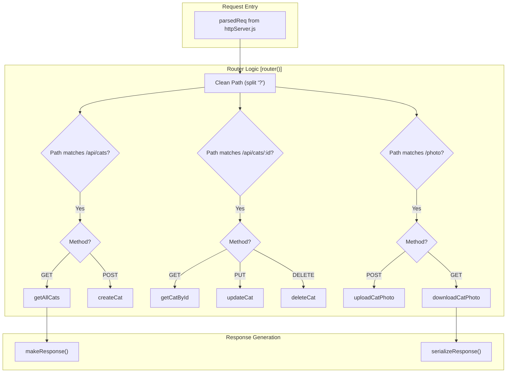
```mermaid
graph TD
    subgraph "Request Entry"
        P["parsedReq from httpServer.js"]
    end

    subgraph "Router Logic [router()]"
        P --> CP["Clean Path (split '?')"]
        CP --> M1{"Path matches /api/cats?"}
        M1 -- "Yes" --> V1{"Method?"}
        V1 -- "GET" --> getAllCats
        V1 -- "POST" --> createCat
        
        CP --> M2{"Path matches /api/cats/:id?"}
        M2 -- "Yes" --> V2{"Method?"}
        V2 -- "GET" --> getCatById
        V2 -- "PUT" --> updateCat
        V2 -- "DELETE" --> deleteCat

        CP --> M3{"Path matches /photo?"}
        M3 -- "Yes" --> V3{"Method?"}
        V3 -- "POST" --> uploadCatPhoto
        V3 -- "GET" --> downloadCatPhoto
    end

    subgraph "Response Generation"
        getAllCats --> RES["makeResponse()"]
        downloadCatPhoto --> SER["serializeResponse()"]
    end
```
**Sources:** [src/server/routes.js:226-240](), [src/server/routes.js:203-222]()

---

# Page: Owners API (ownerRoutes.js)

# Owners API (ownerRoutes.js)

<details>
<summary>Relevant source files</summary>

The following files were used as context for generating this wiki page:

- [src/server/ownerRoutes.js](src/server/ownerRoutes.js)
- [src/server/responseHelpers.js](src/server/responseHelpers.js)
- [tests/api.test.js](tests/api.test.js)

</details>


The Owners API provides a full RESTful interface for managing animal owners and their relationships with cats. It implements advanced CRUD operations, data hydration (embedding related cat records), and specific HTTP optimizations such as ETag-based conditional GETs and gap-filling ID generation.

## 1. Overview and Implementation
The Owners API is encapsulated within `ownerRouter`, which acts as a sub-router dispatched from the main server. It utilizes a shared SQLite database instance for persistence and a set of response helpers to ensure RFC-compliant HTTP serialization.

### Data Flow: Request to Response
1.  **Dispatch**: The `httpServer` receives a request and passes the `parsedReq` object to `ownerRouter` [src/server/ownerRoutes.js:150-151]().
2.  **Routing**: The router matches the `cleanPath` (URL without query strings) and `method` against defined patterns [src/server/ownerRoutes.js:152-182]().
3.  **Processing**: The handler queries the SQLite database via `db.prepare()` [src/server/ownerRoutes.js:46]().
4.  **Hydration**: Owner records are transformed to include an array of owned cats using the `ownerWithCats` helper [src/server/ownerRoutes.js:28-31]().
5.  **Caching Check**: The system computes an MD5 ETag of the payload. If the client provided a matching `If-None-Match` header, it returns a `304 Not Modified` [src/server/ownerRoutes.js:49-51]().
6.  **Serialization**: The final data is passed to `makeResponse`, which handles JSON stringification and header attachment [src/server/responseHelpers.js:24-42]().

### Code Entity Mapping
The following diagram maps the natural language requirements to specific code entities within `ownerRoutes.js`.

**Diagram: Logic to Code Mapping**
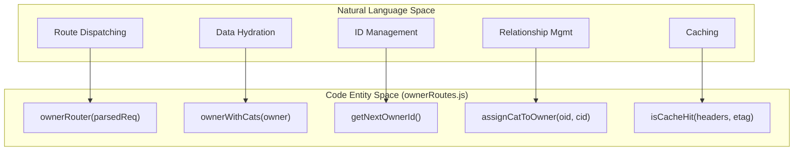
```mermaid
graph TD
    subgraph "Natural Language Space"
        R1["Route Dispatching"]
        R2["Data Hydration"]
        R3["ID Management"]
        R4["Relationship Mgmt"]
        R5["Caching"]
    end

    subgraph "Code Entity Space (ownerRoutes.js)"
        C1["ownerRouter(parsedReq)"]
        C2["ownerWithCats(owner)"]
        C3["getNextOwnerId()"]
        C4["assignCatToOwner(oid, cid)"]
        C5["isCacheHit(headers, etag)"]
    end

    R1 --> C1
    R2 --> C2
    R3 --> C3
    R4 --> C4
    R5 --> C5
```
Sources: [src/server/ownerRoutes.js:13-188](), [src/server/responseHelpers.js:98-114]()

---

## 2. API Endpoints Reference

### Collection Endpoints (`/api/owners`)
| Method | Description | Implementation Detail |
| :--- | :--- | :--- |
| `GET` | List all owners | Hydrates each owner with their `cats` array [src/server/ownerRoutes.js:45-53](). |
| `HEAD` | Metadata for owners | Reuses `GET` logic but strips the body [src/server/ownerRoutes.js:156-159](). |
| `POST` | Create new owner | Validates `name`/`email` and fills ID gaps [src/server/ownerRoutes.js:66-88](). |

### Individual Resource Endpoints (`/api/owners/:id`)
| Method | Description | Implementation Detail |
| :--- | :--- | :--- |
| `GET` | Get owner details | Returns 404 if ID does not exist [src/server/ownerRoutes.js:55-64](). |
| `PUT` | Update owner | Supports partial updates; enforces unique email [src/server/ownerRoutes.js:90-114](). |
| `DELETE` | Remove owner | Triggers `ON DELETE SET NULL` for linked cats [src/server/ownerRoutes.js:116-123](). |

### Relationship Endpoints (`/api/owners/:oid/cats/:cid`)
These endpoints manage the one-to-many relationship between owners and cats.

*   **POST**: Assigns a cat to an owner. It updates the `ownerId` and `updatedAt` fields in the `cats` table [src/server/ownerRoutes.js:125-137]().
*   **DELETE**: Unassigns a cat (sets `ownerId` to `NULL`). Returns `204 No Content` on success [src/server/ownerRoutes.js:139-146]().

---

## 3. Key Technical Features

### Data Hydration
The API does not just return raw database rows. The `ownerWithCats` function intercepts the owner object and performs a sub-query to find all cats where `ownerId` matches the owner's `id` [src/server/ownerRoutes.js:24-31]().

### ID Gap-Filling Logic
Instead of relying solely on SQLite `AUTOINCREMENT`, the `getNextOwnerId` function performs a linear search through existing IDs to find the first available integer starting from 1 [src/server/ownerRoutes.js:14-22](). This ensures that if an owner with ID 2 is deleted, the next created owner will reclaim ID 2.

### Constraint Handling (Unique Email)
The `createOwner` and `updateOwner` functions wrap the `INSERT`/`UPDATE` calls in `try/catch` blocks. If the database throws a `UNIQUE constraint failed: owners.email` error, the API intercepts this and returns a `409 Conflict` with a descriptive message [src/server/ownerRoutes.js:79-84](), [src/server/ownerRoutes.js:105-110]().

### ETag Caching Flow
The system uses MD5 hashing to generate ETags for every GET response. This allows for bandwidth savings via the `If-None-Match` header.

**Diagram: ETag Validation Sequence**
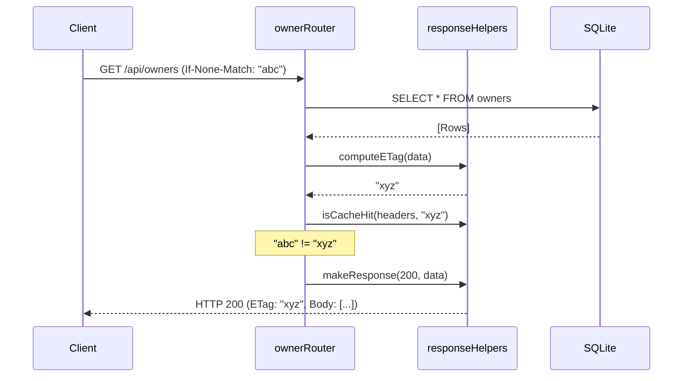
```mermaid
sequenceDiagram
    participant Client
    participant ownerRouter
    participant responseHelpers
    participant SQLite

    Client->>ownerRouter: GET /api/owners (If-None-Match: "abc")
    ownerRouter->>SQLite: SELECT * FROM owners
    SQLite-->>ownerRouter: [Rows]
    ownerRouter->>responseHelpers: computeETag(data)
    responseHelpers-->>ownerRouter: "xyz"
    ownerRouter->>responseHelpers: isCacheHit(headers, "xyz")
    Note over ownerRouter: "abc" != "xyz"
    ownerRouter->>responseHelpers: makeResponse(200, data)
    responseHelpers-->>Client: HTTP 200 (ETag: "xyz", Body: [...])
```
Sources: [src/server/ownerRoutes.js:49-52](), [src/server/responseHelpers.js:93-114]()

---

## 4. Error Handling
The API implements standard HTTP status codes for various failure states:
*   **400 Bad Request**: Invalid JSON payload [src/server/ownerRoutes.js:69]().
*   **404 Not Found**: Resource ID does not exist [src/server/ownerRoutes.js:57]().
*   **405 Method Not Allowed**: Verb not supported for the specific path; includes `Allow` header [src/server/ownerRoutes.js:161]().
*   **409 Conflict**: Duplicate email address [src/server/ownerRoutes.js:81]().
*   **422 Unprocessable Entity**: Missing required fields (`name` or `email`) [src/server/ownerRoutes.js:73]().

Sources: [src/server/ownerRoutes.js:43-188](), [src/server/responseHelpers.js:44-64]()

---

# Page: Authentication API (authRoutes.js)

# Authentication API (authRoutes.js)

<details>
<summary>Relevant source files</summary>

The following files were used as context for generating this wiki page:

- [src/server/authRoutes.js](src/server/authRoutes.js)
- [src/server/middleware.js](src/server/middleware.js)

</details>


The `authRoutes.js` module implements a complete session-based authentication system using SQLite for persistence. It handles user registration with secure password hashing, session management with token-based expiration, and provides a routing mechanism for authentication-specific endpoints.

## Core Implementation Details

### Password Security
The system uses the `PBKDF2-SHA256` algorithm for password hashing.
*   **Salt**: 16 bytes generated via `crypto.randomBytes` [src/server/authRoutes.js:15-23]().
*   **Iterations**: 100,000 rounds [src/server/authRoutes.js:16]().
*   **Key Length**: 32 bytes [src/server/authRoutes.js:17]().
*   **Verification**: Uses `crypto.timingSafeEqual` to prevent timing attacks during password comparison [src/server/authRoutes.js:34]().

### Session Management
Sessions are stored in the `sessions` table. Each session consists of a 32-byte hex-encoded token, a user ID, and an expiration timestamp [src/server/authRoutes.js:47-53]().
*   **Expiry**: Tokens are valid for 1 hour (`3600000` ms) [src/server/authRoutes.js:19]().
*   **Lazy Cleanup**: The `purgeExpiredTokens` function is called every time a new token is created, ensuring the database does not accumulate stale sessions [src/server/authRoutes.js:42-48]().

### Data Flow: Authentication Logic
The following diagram illustrates the relationship between the HTTP request, the authentication logic, and the SQLite database.

**Auth Entity Relationship & Flow**
```mermaid
graph TD
    subgraph "Request Layer"
        R["authRouter(parsedReq)"]
    end

    subgraph "Logic Layer"
        REG["registerUser()"]
        LOG["loginUser()"]
        VLD["validateToken()"]
        HP["hashPassword()"]
    end

    subgraph "Data Layer (db.js)"
        U[("Table: users")]
        S[("Table: sessions")]
    end

    R -->|POST /auth/register| REG
    R -->|POST /auth/login| LOG
    REG --> HP
    HP -->|INSERT| U
    LOG -->|SELECT| U
    LOG -->|createToken| S
    VLD -->|SELECT/DELETE| S
```
Sources: [src/server/authRoutes.js:47-64](), [src/server/authRoutes.js:80-139](), [src/server/authRoutes.js:160-174]()

---

## API Endpoints

The `authRouter` [src/server/authRoutes.js:160]() dispatches requests to the following handlers:

| Endpoint | Method | Description | Implementation |
| :--- | :--- | :--- | :--- |
| `/auth/register` | `POST` | Creates a new user with a hashed password. Enforces a 6-character minimum. | `registerUser` [src/server/authRoutes.js:80]() |
| `/auth/login` | `POST` | Verifies credentials, generates a token, and sets a `Set-Cookie` header. | `loginUser` [src/server/authRoutes.js:105]() |
| `/auth/logout` | `POST` | Deletes the session from the DB and clears the client cookie. | `logoutUser` [src/server/authRoutes.js:141]() |
| `/auth/me` | `GET` | Returns the current user's profile based on the session token. | `getCurrentUser` [src/server/authRoutes.js:148]() |

### Login & Session Generation
When a user logs in successfully, the server generates a response using `serializeResponse` to manually inject a `Set-Cookie` header [src/server/authRoutes.js:128-138](). This cookie is configured with `HttpOnly`, `SameSite=Strict`, and a `Max-Age` of 3600 seconds [src/server/authRoutes.js:134]().

---

## Token Validation & Integration

The `validateToken` function is exported to be used by the `authenticate` middleware [src/server/authRoutes.js:176]().

### Middleware Integration
The `middleware.js` module uses `setTokenValidator` to inject the validation logic from `authRoutes.js` [src/server/middleware.js:68](). This allows the core authentication middleware to check for valid sessions across all `/api/*` routes.

**Authentication Strategy Resolution**
The system checks credentials in the following order of precedence [src/server/middleware.js:70-108]():
1.  `X-API-Key` header.
2.  `Authorization: Bearer <token>` header.
3.  `sessionToken` found in the `Cookie` header.
4.  `X-Session-Token` header.

**Code Entity Mapping: Token Validation**
```mermaid
sequenceDiagram
    participant M as middleware.js:authenticate
    participant A as authRoutes.js:validateToken
    participant D as db.js (SQLite)

    M->>A: validateToken(token)
    A->>D: SELECT userId, expiresAt FROM sessions WHERE token = ?
    D-->>A: session row
    alt Token Expired
        A->>D: DELETE FROM sessions WHERE token = ?
        A-->>M: null
    else Token Valid
        A-->>M: session object
    end
```
Sources: [src/server/authRoutes.js:55-64](), [src/server/middleware.js:94-102]()

---

## Internal Utilities

### ID Gap Filling
The `getNextUserId` function ensures that user IDs are reused if there are gaps in the sequence (e.g., if a user was deleted). It fetches all IDs, sorts them, and finds the first available integer starting from 1 [src/server/authRoutes.js:68-76]().

### Cookie Parsing
The `authRouter` utilizes `parseCookies` from the middleware module to extract the `sessionToken` from the raw `Cookie` header string [src/server/authRoutes.js:166](). It splits the string by `;` and maps key-value pairs into a JavaScript object [src/server/middleware.js:20-29]().

Sources: [src/server/authRoutes.js:68-76](), [src/server/middleware.js:20-29]()

---

# Page: Proxy Route (proxyRoutes.js)

# Proxy Route (proxyRoutes.js)

<details>
<summary>Relevant source files</summary>

The following files were used as context for generating this wiki page:

- [public/rest-client.html](public/rest-client.html)
- [src/server/proxyRoutes.js](src/server/proxyRoutes.js)

</details>


The `/api/proxy` endpoint serves as a server-side utility to bypass Cross-Origin Resource Sharing (CORS) restrictions for client-side applications, specifically the **Quark REST Client**. By routing requests through the catsLibrary server, clients can interact with external APIs or different ports on the same host that do not explicitly allow the client's origin.

## Purpose and Integration

The primary consumer of this route is the **Quark REST Client** (`public/rest-client.html`). Browser-based clients are often blocked by the `Same-Origin Policy` when attempting to reach the raw TCP server (typically on port 3000) from a different origin or when testing external APIs. The `proxyRouter` acts as an intermediary, fetching the requested resource server-side and returning the response to the client.

### Request Flow
The following diagram illustrates the data flow from the GUI through the proxy to a target destination.

**Proxy Data Flow: Client to Target**
```mermaid
graph TD
    subgraph "Browser (Quark Client)"
        A["rest-client.html"] -- "POST {url, method, headers, body}" --> B["/api/proxy"]
    end

    subgraph "catsLibrary Server"
        B --> C["proxyRouter()"]
        C --> D["Header Sanitization"]
        D --> E["fetch(targetUrl)"]
    end

    subgraph "Target Resource"
        E --> F["External API / Local Service"]
        F -- "Binary/Text Data" --> E
    end

    subgraph "Response Serialization"
        E --> G["Buffer.from(arrayBuffer)"]
        G --> H["serializeResponse()"]
        H -- "HTTP/1.1 Response" --> A
    end
```
Sources: [src/server/proxyRoutes.js:5-73](), [public/rest-client.html:1-75]()

## Implementation Details

The `proxyRouter` is an asynchronous function that processes incoming requests. It specifically listens for `POST` requests directed to `/api/proxy` [src/server/proxyRoutes.js:7]().

### Request Schema
The proxy expects a JSON body with the following structure:
*   `url` (String, Required): The destination URL to fetch [src/server/proxyRoutes.js:24-31]().
*   `method` (String, Optional): The HTTP verb (defaults to `GET`) [src/server/proxyRoutes.js:22]().
*   `headers` (Object, Optional): Key-value pairs of headers to forward [src/server/proxyRoutes.js:22]().
*   `body` (String, Optional): The payload for `POST`, `PUT`, or `PATCH` requests [src/server/proxyRoutes.js:43-45]().

### Header Sanitization
To prevent protocol conflicts and ensure the proxy behaves as a transparent intermediary, specific headers are stripped or modified:

| Action | Headers | Reason |
| :--- | :--- | :--- |
| **Removed (Inbound)** | `host`, `connection`, `content-length` | These are managed by the `fetch` API for the new request context [src/server/proxyRoutes.js:39-41](). |
| **Removed (Outbound)** | `content-encoding`, `transfer-encoding`, `connection` | Prevents the client from receiving conflicting compression or chunking instructions from the target [src/server/proxyRoutes.js:53-56](). |
| **Calculated** | `Content-Length` | Recalculated based on the actual size of the buffered body [src/server/proxyRoutes.js:57](). |

Sources: [src/server/proxyRoutes.js:38-41](), [src/server/proxyRoutes.js:52-57]()

### Binary and Buffer Handling
The proxy is designed to be binary-safe. It does not treat the response from the target as plain text initially. Instead:
1.  It retrieves the target response as an `arrayBuffer` [src/server/proxyRoutes.js:49]().
2.  It converts the buffer to a Node.js `Buffer` [src/server/proxyRoutes.js:50]().
3.  The body is serialized using `'binary'` encoding to ensure that non-UTF8 data (like images or compressed files) remains intact during the `serializeResponse` phase [src/server/proxyRoutes.js:63]().

## Error Handling

The route implements two primary error paths:
1.  **400 Bad Request**: Returned if the incoming JSON body is malformed or if the mandatory `url` field is missing [src/server/proxyRoutes.js:14-20](), [src/server/proxyRoutes.js:25-31]().
2.  **502 Bad Gateway**: Returned if the `fetch` operation fails (e.g., DNS resolution failure, connection refused by target, or timeout) [src/server/proxyRoutes.js:66-72]().

**Code Entity Mapping: Error Handling**
```mermaid
graph LR
    subgraph "src/server/proxyRoutes.js"
        direction TB
        PR["proxyRouter(parsedReq)"]
        JSON["JSON.parse(body)"]
        FETCH["fetch(url, options)"]
        SER["serializeResponse()"]
    end

    PR --> JSON
    JSON -- "Catch SyntaxError" --> E400["400 Bad Request"]
    PR --> FETCH
    FETCH -- "Catch Network Error" --> E502["502 Bad Gateway"]
    
    E400 --> SER
    E502 --> SER
```
Sources: [src/server/proxyRoutes.js:9-72](), [src/shared/httpParser.js:3-3]()

## Integration with Quark REST Client

The **Quark REST Client** (`public/rest-client.html`) uses this route to perform requests. When a user enters a URL in the GUI, the client-side logic determines if the request needs to be proxied. If the proxy is active, the client sends a `POST` to `/api/proxy` containing the user's intended request configuration. 

The server-side `proxyRouter` then executes the request and returns the result, which the GUI renders in its response panel, including status codes, headers, and the body.

Sources: [public/rest-client.html:1-100](), [src/server/proxyRoutes.js:5-8]()

---

# Page: Middleware & Security

# Middleware & Security

<details>
<summary>Relevant source files</summary>

The following files were used as context for generating this wiki page:

- [src/server/authRoutes.js](src/server/authRoutes.js)
- [src/server/middleware.js](src/server/middleware.js)

</details>


This section provides an overview of the security model and the middleware pipeline utilized by the `catsLibrary` server. The system employs a custom middleware chain to handle cross-cutting concerns such as access logging, credential validation, and HTTP response standardization.

## Middleware Pipeline Overview

The server processes incoming requests through a sequence of functions before they reach the domain-specific route handlers. This pipeline ensures that every request is logged, authenticated (if targeting the `/api/` prefix), and that responses are formatted consistently using shared helpers.

### Request Lifecycle & Code Entities
The following diagram illustrates how the natural language concept of a "Request Pipeline" maps to specific functions and files within the codebase.

**Diagram: Request Middleware Flow**
```mermaid
graph TD
    subgraph "Middleware Layer (src/server/middleware.js)"
        A["Incoming Socket Data"] --> B["authenticate()"]
        B --> C["isValidApiKey()"]
        B --> D["_validateToken()"]
    end

    subgraph "Routing Layer"
        B -- "Authenticated" --> E["Router Dispatch"]
        E --> F["authRouter() (src/server/authRoutes.js)"]
        E --> G["routes.js / ownerRoutes.js"]
    end

    subgraph "Logging & Response"
        F --> H["makeResponse() (src/server/responseHelpers.js)"]
        G --> H
        H --> I["logRequest()"]
        I --> J["Socket Write"]
    end
```
**Sources:** [src/server/middleware.js:70-108](), [src/server/authRoutes.js:160-174](), [src/server/responseHelpers.js:20-37]()

## Authentication & Authorization

The security model is primarily focused on protecting the REST API. While static assets and the root path are generally accessible, any request starting with `/api/` triggers the `authenticate` logic [src/server/middleware.js:73-75]().

The system supports a multi-strategy credential resolution order:
1.  **Static API Keys**: Checked via the `X-API-Key` header [src/server/middleware.js:80-81]().
2.  **Bearer Tokens**: Parsed from the `Authorization` header, supporting both API keys and session tokens [src/server/middleware.js:84-89]().
3.  **Session Cookies**: Extracted using `parseCookies` to find the `sessionToken` [src/server/middleware.js:92-96]().
4.  **Custom Session Headers**: The `X-Session-Token` header for clients that cannot easily manage cookies [src/server/middleware.js:99-102]().

For a deep dive into the implementation of these strategies and the token validation logic, see **[Authentication Middleware](#4.1)**.

## Response Helpers & Caching

To maintain consistency across the API, the codebase utilizes a `responseHelpers.js` module. These utilities handle the construction of HTTP-compliant response objects, including the calculation of `Content-Length` and `ETag` headers for caching.

| Helper | Purpose | Source |
| :--- | :--- | :--- |
| `makeResponse` | Generates a standard JSON response with status codes and body. | [src/server/responseHelpers.js:20-37]() |
| `makeEmptyResponse` | Used for `204 No Content` or `304 Not Modified` responses. | [src/server/responseHelpers.js:45-56]() |
| `computeETag` | Generates an MD5 hash of the response body for cache validation. | [src/server/responseHelpers.js:64-67]() |

The caching mechanism relies on the `If-None-Match` header to perform "Not Modified" checks, reducing bandwidth for repeated requests. Details on the binary-safe serialization and caching logic are available in **[Response Helpers & Caching](#4.2)**.

## Access Logging

Every request handled by the server is recorded in the Apache Combined Log Format. This is managed by the `logRequest` function, which captures the remote address, request method, path, status code, and user agent [src/server/middleware.js:41-51]().

**Entity Mapping: Logging System**
```mermaid
graph LR
    subgraph "Code Entities"
        LR["logRequest()"]
        LF["LOG_FILE"]
        FS["fs.appendFile"]
    end

    subgraph "External/Output"
        STDOUT["Console (Colorized)"]
        FILE["/logs/access.log"]
    end

    LR --> STDOUT
    LR --> FS
    FS --> FILE
    LF -- "defines path" --> FS
```
**Sources:** [src/server/middleware.js:12-16](), [src/server/middleware.js:41-62]()

## Child Pages
- **[Authentication Middleware](#4.1)**: Details on credential resolution, `setTokenValidator` dependency injection, and session management.
- **[Response Helpers & Caching](#4.2)**: Details on the `makeResponse` pipeline, ETag generation, and binary-safe HTTP serialization.

---

# Page: Authentication Middleware

# Authentication Middleware

<details>
<summary>Relevant source files</summary>

The following files were used as context for generating this wiki page:

- [src/server/middleware.js](src/server/middleware.js)

</details>


The `middleware.js` module provides the security and observability layer for the catsLibrary server. It implements a multi-strategy authentication mechanism for API protection and an Apache-style access logger for request monitoring.

### 1. Request Logging

The `logRequest` function implements a logging mechanism that outputs to both the standard console and a persistent log file. It captures request metadata from the `parsedReq` object and response status from the `res` object.

*   **Format**: It uses the Apache Combined Log Format, capturing the timestamp, remote address, HTTP method, path, protocol version, status code, content length, referer, and user agent [src/server/middleware.js:41-51]().
*   **Storage**: Logs are persisted to `logs/access.log`. The middleware ensures the directory exists during initialization [src/server/middleware.js:12-16]().
*   **Console Output**: Includes ANSI color-coding for status codes (e.g., green for 2xx, red for 4xx) to assist in real-time debugging [src/server/middleware.js:53-57]().

#### Data Flow: Request Logging
The following diagram illustrates how the `logRequest` function extracts data from the internal request/response objects to generate log entries.

```mermaid
graph TD
    subgraph "Internal State"
        A["parsedReq (Object)"]
        B["res (Object)"]
    end

    subgraph "logRequest() Logic"
        C["Extract Headers: user-agent, referer"]
        D["Extract Metadata: method, path, httpVersion"]
        E["Extract Status: statusCode, contentLength"]
        F["Format Apache Combined String"]
    end

    subgraph "Outputs"
        G["console.log (ANSI Colored)"]
        H["fs.appendFile (logs/access.log)"]
    end

    A --> C
    A --> D
    B --> E
    C --> F
    D --> F
    E --> F
    F --> G
    F --> H
```
Sources: [src/server/middleware.js:41-62]()

---

### 2. Authentication Strategy

The `authenticate()` function serves as the gatekeeper for all `/api/` routes. While static files and base routes are publicly accessible, any path starting with `/api` requires valid credentials [src/server/middleware.js:70-75]().

#### Multi-Strategy Resolution Order
The middleware attempts to resolve credentials in a specific order of precedence. If any check succeeds, the request is marked as `authenticated: true`.

| Order | Strategy | Detail |
| :--- | :--- | :--- |
| 1 | **X-API-Key Header** | Direct lookup in the `api_keys` table via `isValidApiKey` [src/server/middleware.js:79-81](). |
| 2 | **Bearer Token** | Checks `Authorization: Bearer <token>`. Supports both API keys and session tokens [src/server/middleware.js:83-89](). |
| 3 | **Session Cookie** | Parses the `cookie` header for `sessionToken` [src/server/middleware.js:91-96](). |
| 4 | **X-Session-Token** | Custom header check for `x-session-token` [src/server/middleware.js:98-102](). |

#### Credential Resolution Flow
This diagram maps the natural language strategies to the specific code entities and database lookups performed during the `authenticate()` lifecycle.

```mermaid
flowchart TD
    REQ["parsedReq"] --> PATH{"Path starts with /api?"}
    PATH -- "No" --> PASS["authenticated: true"]
    PATH -- "Yes" --> API_KEY{"Header: x-api-key"}
    
    API_KEY -- "Present" --> DB_API["isValidApiKey(key)"]
    DB_API -- "Found in api_keys table" --> PASS
    
    API_KEY -- "Missing/Invalid" --> BEARER{"Header: Authorization"}
    BEARER -- "Bearer <token>" --> VAL_BEARER["_validateToken(token)"]
    VAL_BEARER -- "Valid Session" --> PASS
    
    BEARER -- "Missing" --> COOKIE{"Header: cookie"}
    COOKIE -- "sessionToken=..." --> VAL_COOKIE["_validateToken(token)"]
    VAL_COOKIE -- "Valid Session" --> PASS
    
    VAL_COOKIE -- "Invalid" --> FAIL["authenticated: false (401)"]
```
Sources: [src/server/middleware.js:70-108](), [src/server/middleware.js:33-37]()

---

### 3. Dependency Injection & Utilities

The middleware module is designed to be decoupled from the specific session management logic via dependency injection and utility functions.

#### Token Validation Injection
Because `middleware.js` handles the request flow but `authRoutes.js` (or similar) typically manages session lifecycles, the module uses a setter for the validation logic:
*   `setTokenValidator(fn)`: Sets a private `_validateToken` reference used during authentication checks [src/server/middleware.js:66-68]().
*   This allows the middleware to verify session tokens against the database without having a circular dependency on the authentication route handlers.

#### Cookie Parsing
The `parseCookies` function is a standalone utility that converts the raw `Cookie` header string into a key-value object [src/server/middleware.js:20-29]().
*   It handles multiple cookies separated by semicolons.
*   It uses `Object.fromEntries` for efficient mapping of trimmed key-value pairs [src/server/middleware.js:22-28]().

#### API Key Verification
The `isValidApiKey(key)` function performs a synchronous SQLite query against the `api_keys` table [src/server/middleware.js:33-37](). It returns `true` only if the key exists in the database, providing a stateless alternative to session-based authentication.

Sources: [src/server/middleware.js:20-37](), [src/server/middleware.js:66-68]()

---

# Page: Response Helpers & Caching

# Response Helpers & Caching

<details>
<summary>Relevant source files</summary>

The following files were used as context for generating this wiki page:

- [src/server/responseHelpers.js](src/server/responseHelpers.js)
- [tests/api.test.js](tests/api.test.js)

</details>


The `responseHelpers.js` module provides a standardized utility layer for constructing HTTP responses across the `catsLibrary` server. It encapsulates header management, status code assignment, and RFC 7232-compliant caching logic, ensuring that all route modules produce consistent, binary-safe output for the underlying TCP engine.

[src/server/responseHelpers.js:1-5]()

## Core Response Builders

The module exports three primary factory functions that abstract the complexity of HTTP serialization. These functions automatically inject the `X-Powered-By` header using the `SERVER_HEADER` constant [src/server/responseHelpers.js:10-10]().

### makeResponse
This is the primary helper for JSON-based API responses. It handles the transformation of JavaScript objects into a binary-safe string format compatible with the custom HTTP parser.

1.  **Serialization**: It stringifies the data with 2-space indentation [src/server/responseHelpers.js:25-25]().
2.  **Binary Safety**: It converts the JSON string into a UTF-8 Buffer, then converts that buffer to a 'binary' encoded string to preserve byte integrity during the `serializeResponse` phase [src/server/responseHelpers.js:26-27]().
3.  **Automatic Headers**: It calculates and sets `Content-Type`, `Content-Length`, `ETag` (MD5 hash), and `Last-Modified` [src/server/responseHelpers.js:33-37]().

### makeEmptyResponse
Used for status codes that typically carry no payload, such as `204 No Content` or `405 Method Not Allowed` [src/server/responseHelpers.js:53-64](). It ensures `Content-Length` is explicitly set to `"0"` to prevent client-side timeouts on raw TCP sockets.

### makeNotModified
A specialized helper for `304 Not Modified` responses. It accepts an existing ETag and returns a response with no body, signaling the client to use its cached version [src/server/responseHelpers.js:73-84]().

### Response Generation Flow
The following diagram illustrates how a route handler utilizes these helpers to feed the serialization pipeline.

**Response Construction Pipeline**
```mermaid
graph TD
    subgraph "Route_Handler"
        A["Data Object"] --> B["makeResponse()"]
    end

    subgraph "responseHelpers.js"
        B --> C["JSON.stringify"]
        C --> D["Buffer.from(utf8)"]
        D --> E["computeETag (MD5)"]
        E --> F["serializeResponse()"]
    end

    subgraph "httpParser.js"
        F --> G["HTTP/1.1 String Output"]
    end

    G --> H["Socket.write()"]
```
Sources: [src/server/responseHelpers.js:24-42](), [src/shared/httpParser.js:7-7]()

## Caching & Conditional GET

The library implements a basic ETag-based caching mechanism to reduce bandwidth and processing overhead for repeated requests.

### ETag Generation
ETags are generated by creating an MD5 hash of the serialized JSON body. This ensures that any change in the data—no matter how small—results in a cache invalidation.
*   **Function**: `computeETag(data)` [src/server/responseHelpers.js:93-96]()
*   **Format**: The resulting hash is wrapped in double quotes (e.g., `"abc123"`) to comply with HTTP standards.

### Cache Validation Logic
The `isCacheHit` function implements the server-side check for the `If-None-Match` header [src/server/responseHelpers.js:106-114]().

| Feature | Implementation |
| :--- | :--- |
| **Header Checked** | `if-none-match` (case-insensitive) |
| **Wildcard Support** | Returns `true` if header is `*` |
| **Comparison** | Direct string comparison with current computed ETag |
| **If-Modified-Since** | Explicitly ignored (returns `false`) as the system lacks per-resource timestamps [src/server/responseHelpers.js:111-113]() |

**Conditional GET Sequence**
```mermaid
sequenceDiagram
    participant Client
    participant Router
    participant responseHelpers.js
    
    Client->>Router: GET /api/cats (If-None-Match: "v1")
    Router->>responseHelpers.js: computeETag(currentData)
    Note over responseHelpers.js: Returns "v1"
    Router->>responseHelpers.js: isCacheHit(reqHeaders, "v1")
    
    alt isCacheHit is true
        Router->>responseHelpers.js: makeNotModified("v1")
        responseHelpers.js-->>Client: 304 Not Modified
    else isCacheHit is false
        Router->>responseHelpers.js: makeResponse(200, "OK", currentData)
        responseHelpers.js-->>Client: 200 OK (with new ETag)
    end
```
Sources: [src/server/responseHelpers.js:93-114](), [tests/api.test.js:171-181]()

## Integration in Route Handlers

Route modules (like `routes.js` or `ownerRoutes.js`) do not manually construct HTTP strings. They follow a pattern of computing the ETag first to potentially exit early with a `304` response.

```javascript
// Example usage pattern in API routes
const currentData = db.getAll();
const etag = computeETag(currentData);

if (isCacheHit(req.headers, etag)) {
  return makeNotModified(etag);
}
return makeResponse(200, 'OK', currentData);
```

### Summary of Exported Entities

| Entity | Type | Description |
| :--- | :--- | :--- |
| `makeResponse` | Function | Creates a 200/201 JSON response with full headers. |
| `makeEmptyResponse` | Function | Creates responses without bodies (204, 405, etc). |
| `makeNotModified` | Function | Creates a 304 response with the provided ETag. |
| `computeETag` | Function | MD5 hashing utility for data consistency checks. |
| `isCacheHit` | Function | Evaluates `If-None-Match` against current state. |
| `SERVER_HEADER` | Constant | String identifier `usj-http-server/1.0`. |

Sources: [src/server/responseHelpers.js:10-10](), [src/server/responseHelpers.js:116-116]()

---

# Page: Data Layer

# Data Layer

<details>
<summary>Relevant source files</summary>

The following files were used as context for generating this wiki page:

- [src/server/db.js](src/server/db.js)
- [usj-cat-shelter.db](usj-cat-shelter.db)

</details>


The **Data Layer** of the catsLibrary project provides a persistent storage mechanism using a local SQLite database. It manages entity lifecycles for cats and owners, handles user authentication storage, and maintains session state for the custom HTTP server.

The persistence layer is built on the `better-sqlite3` library, chosen for its synchronous API which simplifies the execution flow within the server's request-response lifecycle [src/server/db.js:8]().

## System Architecture: Code to Persistence

The following diagram illustrates how high-level system concepts map to specific code entities and the underlying SQLite storage structure.

### Data Entity Mapping
```mermaid
graph TD
    subgraph "Natural Language Space"
        A["Cat Entity"]
        B["Owner Entity"]
        C["User/Auth Entity"]
    end

    subgraph "Code Entity Space (src/server/db.js)"
        D["initDb()"]
        E["seedIfEmpty()"]
        F["getNextId()"]
    end

    subgraph "SQLite Persistence (usj-cat-shelter.db)"
        G[("Table: cats")]
        H[("Table: owners")]
        I[("Table: users")]
        J[("Table: sessions")]
        K[("Table: api_keys")]
    end

    A --> G
    B --> H
    C --> I
    C --> J
    C --> K

    D -- "Defines Schema" --> G
    D -- "Defines Schema" --> H
    E -- "Populates" --> G
    E -- "Populates" --> H
    F -- "Manages Primary Keys" --> G
```
**Sources:** [src/server/db.js:12-75](), [src/server/db.js:152-160]()

## Database Management (`db.js`)

The core of the data layer is contained in `src/server/db.js`. This module is responsible for opening the database connection, enforcing data integrity via foreign keys, and initializing the schema if it does not exist.

### Core Responsibilities
*   **Initialization:** The `initDb()` function creates five mandatory tables: `owners`, `cats`, `users`, `sessions`, and `api_keys` [src/server/db.js:19-75]().
*   **Integrity:** Foreign key constraints are explicitly enabled using `PRAGMA foreign_keys = ON` [src/server/db.js:16](). Relationships include:
    *   `cats.ownerId` → `owners.id` (ON DELETE SET NULL) [src/server/db.js:43]().
    *   `sessions.userId` → `users.id` (ON DELETE CASCADE) [src/server/db.js:62]().
*   **Primary Key Management:** Instead of relying solely on standard autoincrement for all logic, the `getNextId(table)` utility is used to find the first available integer ID, effectively filling gaps left by deleted records [src/server/db.js:152-160]().

For a deep dive into table definitions and initialization logic, see [Database Schema & Initialization (db.js)](#5.1).

**Sources:** [src/server/db.js:12-16](), [src/server/db.js:19-75](), [src/server/db.js:152-160]()

## Data Models and Relationships

The system manages a one-to-many relationship between owners and cats. Each cat can optionally be assigned to one owner, while an owner can have multiple cats.

### Entity Relationship Diagram
```mermaid
erDiagram
    USERS ||--o{ SESSIONS : "has"
    OWNERS ||--o{ CATS : "owns"
    
    USERS {
        int id PK
        string username
        string passwordHash
    }
    SESSIONS {
        string token PK
        int userId FK
        int expiresAt
    }
    OWNERS {
        int id PK
        string name
        string email
    }
    CATS {
        int id PK
        string name
        int ownerId FK
        string photo "Base64"
    }
    API_KEYS {
        string key PK
        string description
    }
```
**Sources:** [src/server/db.js:20-72]()

### Key Data Features
*   **Photo Storage:** Cat photos are stored directly in the `cats` table as Base64 encoded strings in the `photo` column, accompanied by a `photoMime` field [src/server/db.js:39-40]().
*   **Seeding Mechanism:** On first run, `seedIfEmpty()` populates the database with initial records and attempts to load default cat images from `public/assets/` using the `loadDefaultCatImage()` helper [src/server/db.js:78-149]().
*   **Two-Tier Authentication:** The data layer supports both stateful `sessions` (linked to users) and stateless `api_keys` for programmatic access [src/server/db.js:58-72]().

For details on specific field types and constraints, see [Data Models & Relationships](#5.2).

**Sources:** [src/server/db.js:32-45](), [src/server/db.js:78-126](), [src/server/db.js:129-149]()

---

# Page: Database Schema & Initialization (db.js)

# Database Schema & Initialization (db.js)

<details>
<summary>Relevant source files</summary>

The following files were used as context for generating this wiki page:

- [public/assets/cat1.png](public/assets/cat1.png)
- [public/assets/cat2.png](public/assets/cat2.png)
- [public/assets/cat3.png](public/assets/cat3.png)
- [src/server/db.js](src/server/db.js)
- [usj-cat-shelter.db](usj-cat-shelter.db)

</details>


The `db.js` module serves as the persistence layer for the USJ Cat Shelter management system. It utilizes `better-sqlite3` to manage a local SQLite database file, handling schema creation, data integrity via foreign keys, and initial data seeding.

### Database Connection & Configuration

The database is stored in a file named `usj-cat-shelter.db` located in the project root [src/server/db.js:12-13](). Upon initialization, the module explicitly enables foreign key support using a PRAGMA statement to ensure relational integrity [src/server/db.js:16]().

### Schema Definition

The system defines five primary tables to handle shelter operations, user authentication, and API access control.

| Table | Purpose | Primary Key | Constraints |
| :--- | :--- | :--- | :--- |
| `owners` | Stores contact information for cat owners. | `id` (AUTOINCREMENT) | `email` is UNIQUE. [src/server/db.js:22-28]() |
| `cats` | Stores cat profiles and associations. | `id` (AUTOINCREMENT) | `ownerId` references `owners.id` (ON DELETE SET NULL). [src/server/db.js:31-45]() |
| `users` | Stores credentials for administrative access. | `id` (AUTOINCREMENT) | `username` is UNIQUE. [src/server/db.js:49-54]() |
| `sessions` | Tracks active authenticated sessions. | `token` | `userId` references `users.id` (ON DELETE CASCADE). [src/server/db.js:57-64]() |
| `api_keys` | Provides static keys for programmatic access. | `key` | None. [src/server/db.js:67-72]() |

#### Entity Relationship Diagram

The following diagram illustrates the relationships between code entities and the database tables they manage.

```mermaid
erDiagram
    "db.js" ||--o{ "owners_table" : "manages"
    "db.js" ||--o{ "cats_table" : "manages"
    "db.js" ||--o{ "users_table" : "manages"
    "db.js" ||--o{ "sessions_table" : "manages"
    "db.js" ||--o{ "api_keys_table" : "manages"

    "owners_table" ||--o{ "cats_table" : "one-to-many (ownerId)"
    "users_table" ||--o{ "sessions_table" : "one-to-many (userId)"

    "cats_table" {
        int id
        string name
        int ownerId
        string photo
    }
    "sessions_table" {
        string token
        int userId
        int expiresAt
    }
```
**Sources:** [src/server/db.js:19-72]()

### Initialization Lifecycle

The `initDb()` function is executed immediately when the module is required [src/server/db.js:163](). This ensures that the environment is ready before any routes or services attempt to query the data.

1.  **Table Creation**: Executes `CREATE TABLE IF NOT EXISTS` for all five tables [src/server/db.js:21-72]().
2.  **Seeding**: Calls `seedIfEmpty()` to populate the database if no owners exist [src/server/db.js:74]().
3.  **Asset Ingestion**: During seeding, the system looks for default cat images in `public/assets/` [src/server/db.js:129-149]().

#### Data Flow: Seeding and Asset Ingestion

```mermaid
sequenceDiagram
    participant DB as db.js (initDb)
    participant Seed as seedIfEmpty()
    participant Asset as loadDefaultCatImage()
    participant FS as File System (public/assets/)

    DB->>Seed: Check if owners table is empty
    alt Table is Empty
        Seed->>Seed: Insert Default Owners (Alice, Bob)
        Seed->>Asset: Request images for Cat 1, 2, 3
        loop For each extension (.jpg, .png, etc)
            Asset->>FS: Check if cat[ID].[ext] exists
            FS-->>Asset: Return binary data
        end
        Asset-->>Seed: Return Base64 string & MimeType
        Seed->>DB: INSERT into cats (with Base64 photo)
        Seed->>DB: INSERT default API keys
    end
```
**Sources:** [src/server/db.js:78-149]()

### Key Utilities

#### loadDefaultCatImage(id)
This helper function attempts to find an image file matching `cat${id}` with various extensions (`.jpg`, `.png`, `.svg`, `.webp`) in the `public/assets` directory [src/server/db.js:130-138](). If found, it reads the file and converts it into a **Base64 string** for storage directly in the `cats.photo` column [src/server/db.js:142]().

#### getNextId(table)
A utility used by the API routes to maintain a continuous ID sequence. Instead of relying purely on SQLite's `AUTOINCREMENT` (which never reuses IDs), `getNextId` scans the table to find the first available integer gap [src/server/db.js:152-160]().

```javascript
// Implementation of gap-filling logic
function getNextId(table) {
  const ids = db.prepare(`SELECT id FROM ${table} ORDER BY id ASC`).all().map(r => r.id);
  let nextId = 1;
  for (const id of ids) {
    if (id === nextId) nextId++;
    else break;
  }
  return nextId;
}
```
**Sources:** [src/server/db.js:152-160](), [src/server/db.js:166]()

### Integrity Constraints
*   **ON DELETE SET NULL**: When an owner is deleted, the `ownerId` field in the `cats` table is set to `NULL`, but the cat record is preserved [src/server/db.js:43]().
*   **ON DELETE CASCADE**: When a user is deleted, all associated records in the `sessions` table are automatically removed [src/server/db.js:62]().
*   **UNIQUE Constraints**: Enforced on `owners.email` [src/server/db.js:25]() and `users.username` [src/server/db.js:51]() to prevent duplicate registrations.

**Sources:** [src/server/db.js:1-167]()

---

# Page: Data Models & Relationships

# Data Models & Relationships

<details>
<summary>Relevant source files</summary>

The following files were used as context for generating this wiki page:

- [src/server/db.js](src/server/db.js)
- [src/server/ownerRoutes.js](src/server/ownerRoutes.js)
- [src/server/routes.js](src/server/routes.js)

</details>


This page details the structural organization of the USJ Cat Shelter data layer. The system utilizes a relational SQLite database to manage entities, their associations, and the security credentials required for system access.

## Entity Schemas

The persistence layer is built on `better-sqlite3` and defines five primary tables. Data integrity is enforced through primary keys, unique constraints, and foreign key relationships.

### Cat Entity
The `cats` table stores the core animal records. It includes metadata for tracking creation and updates, as well as binary-safe photo storage.

| Field | Type | Constraints | Description |
| :--- | :--- | :--- | :--- |
| `id` | INTEGER | PRIMARY KEY | Unique identifier (gap-filling logic applied) |
| `name` | TEXT | NOT NULL | Name of the cat |
| `breed` | TEXT | NOT NULL | Breed of the cat |
| `age` | INTEGER | | Age in years |
| `color` | TEXT | | Fur color description |
| `ownerId` | INTEGER | FK (owners.id) | Reference to the owner; `ON DELETE SET NULL` |
| `photo` | TEXT | | Base64 encoded image data |
| `photoMime` | TEXT | | MIME type (e.g., `image/jpeg`) |
| `createdAt`| TEXT | NOT NULL | ISO 8601 timestamp |
| `updatedAt`| TEXT | NOT NULL | ISO 8601 timestamp |

### Owner Entity
The `owners` table manages human contact information and serves as the parent in the one-to-many relationship with cats.

| Field | Type | Constraints | Description |
| :--- | :--- | :--- | :--- |
| `id` | INTEGER | PRIMARY KEY | Unique identifier |
| `name` | TEXT | NOT NULL | Full name of the owner |
| `email` | TEXT | NOT NULL, UNIQUE | Unique contact email |
| `phone` | TEXT | | Contact phone number |

**Sources:** [src/server/db.js:21-45](), [src/server/db.js:152-160]()

---

## Relationships & Data Flow

The system implements a classic **One-to-Many** relationship where one owner can possess multiple cats, but each cat belongs to at most one owner.

### Implementation Details
- **Foreign Key Enforcement**: The database is initialized with `PRAGMA foreign_keys = ON` [src/server/db.js:16]().
- **Cascade Behavior**: If an owner is deleted, the `ownerId` in the `cats` table is automatically set to `NULL` via the `ON DELETE SET NULL` constraint [src/server/db.js:43](), effectively making the cat "available for adoption" rather than deleting the animal record.
- **Data Hydration**: When fetching owners via `getOwnerById` or `getAllOwners`, the system "hydrates" the owner object by querying the `cats` table for all matching `ownerId` values [src/server/ownerRoutes.js:24-31]().

### Code-to-Entity Mapping: Relationship Management
The following diagram illustrates how route handlers interact with the SQLite entities to manage associations.

**Owner-Cat Association Logic**
```mermaid
graph TD
  subgraph "Code Space (ownerRoutes.js)"
    A["assignCatToOwner(ownerId, catId)"]
    B["unassignCatFromOwner(ownerId, catId)"]
    C["ownerWithCats(owner)"]
  end

  subgraph "Data Space (usj-cat-shelter.db)"
    TableCats["Table: cats"]
    TableOwners["Table: owners"]
  end

  A -- "UPDATE cats SET ownerId = ? WHERE id = ?" --> TableCats
  B -- "UPDATE cats SET ownerId = NULL WHERE id = ?" --> TableCats
  C -- "SELECT * FROM cats WHERE ownerId = ?" --> TableCats
  TableCats -- "FOREIGN KEY (ownerId)" --> TableOwners
```
**Sources:** [src/server/ownerRoutes.js:24-31](), [src/server/ownerRoutes.js:125-146](), [src/server/db.js:43]()

---

## Multimedia Storage (Base64)

Unlike traditional file-system storage, this project stores images directly within the SQLite `cats` table.

1.  **Ingestion**: Photos are received via `POST /api/cats/:id/photo` as either raw binary buffers or JSON Data URLs [src/server/routes.js:159-187]().
2.  **Transformation**: The server converts binary buffers to Base64 strings using `Buffer.from(body, "binary").toString("base64")` [src/server/routes.js:168]().
3.  **Storage**: The Base64 string is stored in the `photo` column, and the detected MIME type is stored in `photoMime` [src/server/routes.js:190-191]().
4.  **Retrieval**: When `downloadCatPhoto` is called, the Base64 string is converted back to a binary buffer and streamed with the correct `Content-Type` header [src/server/routes.js:210-221]().

**Sources:** [src/server/routes.js:159-222](), [src/server/db.js:129-149]()

---

## Two-Tier Access System

The codebase supports two distinct authentication strategies, represented by the `sessions` and `api_keys` tables.

### 1. Session-Based Access (Stateful)
Used primarily by the Browser GUI and CLI client. It involves a `users` table for credentials and a `sessions` table for active tokens.
- **Table `users`**: Stores `username` and `passwordHash` (PBKDF2) [src/server/db.js:49-54]().
- **Table `sessions`**: Links a random `token` to a `userId` with an `expiresAt` timestamp [src/server/db.js:57-64]().

### 2. API Key Access (Stateless)
Used for programmatic access or bot integration (e.g., the Minecraft bot).
- **Table `api_keys`**: A simple lookup table where the `key` is the primary identifier [src/server/db.js:68-72]().

### Code-to-Entity Mapping: Access Control
The diagram below shows how the authentication middleware maps incoming request identifiers to the database entities.

**Authentication Strategy Mapping**
```mermaid
graph LR
  subgraph "Request Space"
    Cookie["Cookie: session=..."]
    HeaderKey["X-API-Key: ..."]
    HeaderToken["X-Session-Token: ..."]
  end

  subgraph "Code Space (authenticate middleware)"
    AuthFn["authenticate(req)"]
  end

  subgraph "Data Space (usj-cat-shelter.db)"
    TableSessions["Table: sessions"]
    TableKeys["Table: api_keys"]
  end

  Cookie -- "extract token" --> AuthFn
  HeaderToken -- "extract token" --> AuthFn
  HeaderKey -- "extract key" --> AuthFn

  AuthFn -- "SELECT * FROM sessions WHERE token = ?" --> TableSessions
  AuthFn -- "SELECT * FROM api_keys WHERE key = ?" --> TableKeys
```
**Sources:** [src/server/db.js:57-72](), [src/server/authenticate.js:25-50]() (referenced for logic context)

---

## ID Management (Gap Filling)

To maintain a clean sequence in the shelter records, the system does not rely solely on SQLite's `AUTOINCREMENT` for new records. Instead, it uses a utility function `getNextId` (and local variations like `getNextCatId`) to find the lowest available integer ID.

- **Logic**: It selects all existing IDs, sorts them, and iterates to find the first missing number in the sequence [src/server/db.js:152-160]().
- **Usage**: This is applied during the creation of both Cats [src/server/routes.js:24-32]() and Owners [src/server/ownerRoutes.js:14-22]().

**Sources:** [src/server/db.js:152-160](), [src/server/routes.js:94](), [src/server/ownerRoutes.js:76]()

---

# Page: Client Interfaces

# Client Interfaces

<details>
<summary>Relevant source files</summary>

The following files were used as context for generating this wiki page:

- [public/client.html](public/client.html)
- [public/favicon.png](public/favicon.png)
- [public/rest-client.html](public/rest-client.html)
- [src/client/httpClient.js](src/client/httpClient.js)
- [src/client/index.js](src/client/index.js)

</details>


The catsLibrary project provides multiple ways to interact with the Cat Shelter API, ranging from a low-level programmatic library to high-level graphical user interfaces. These interfaces demonstrate the flexibility of the custom HTTP/1.1 implementation and provide tools for both developers and end-users.

## Interface Architecture

The system bridges the gap between raw network communication and user interaction through four distinct layers:

1.  **Low-Level Library**: A custom TCP-based HTTP client.
2.  **CLI**: A terminal-based interactive management tool.
3.  **Browser GUI**: A Single Page Application (SPA) for shelter management.
4.  **Quark REST Client**: A specialized tool for API debugging and proxy testing.

### System Mapping: From Code to Interface

The following diagram maps the primary code entities to their roles in the client ecosystem.

**Client Entity Relationship Diagram**
```mermaid
graph TD
    subgraph "Code Entity Space"
        HTTP_C["httpClient.js"]
        CLI_IDX["src/client/index.js"]
        GUI_HTML["public/client.html"]
        QUARK_HTML["public/rest-client.html"]
    end

    subgraph "Interface Space"
        CLI["CLI Terminal Interface"]
        BROWSER["Management SPA"]
        QUARK["REST Debugger"]
    end

    HTTP_C -- "Provides request()" --> CLI_IDX
    HTTP_C -- "Manages" --> JAR["CookieJar"]
    CLI_IDX -- "Executes" --> CLI
    GUI_HTML -- "Renders" --> BROWSER
    QUARK_HTML -- "Renders" --> QUARK
    
    CLI -- "Uses" --> S_API["Server API (Port 3000)"]
    BROWSER -- "Uses" --> S_API
    QUARK -- "Uses" --> PROXY["/api/proxy"]
```
Sources: [src/client/httpClient.js:1-12](), [src/client/index.js:1-15](), [public/client.html:7-9](), [public/rest-client.html:6-7]()

---

## HTTP Client Library (httpClient.js)

The foundation of the CLI and programmatic interaction is `httpClient.js`. This library bypasses Node.js's built-in `http` module, using `net.Socket` to implement a raw HTTP/1.1 client [src/client/httpClient.js:3-12]().

*   **Core Function**: The `request()` function handles URL parsing via `parseUrl` [src/client/httpClient.js:28-35](), header injection, and binary-safe response accumulation using `Buffer.concat` [src/client/httpClient.js:195-196]().
*   **State Management**: Includes a `CookieJar` class that implements RFC 6265 compliant cookie storage [src/client/httpClient.js:43-47](). It automatically manages `Set-Cookie` headers and injects `Cookie` headers into subsequent requests [src/client/httpClient.js:177-178]().
*   **Session Tracking**: Manages a global `sessionToken` which is automatically attached as an `X-Session-Token` header [src/client/httpClient.js:174]().

For details, see [HTTP Client Library (httpClient.js)](#6.1).

---

## CLI Client (src/client/index.js)

The interactive CLI provides a menu-driven interface for performing CRUD operations on cats and owners, as well as managing user authentication [src/client/index.js:46-72]().

*   **Command Suite**: Supports operations like `listCats`, `createCat`, `uploadPhoto`, and `loginUser` [src/client/index.js:103-163]().
*   **Visual Feedback**: Uses ANSI color codes for status-dependent response printing (green for 2xx, red for 4xx/5xx) [src/client/index.js:74-78]().
*   **Integration**: Directly utilizes the `httpClient.js` library to communicate with the server at `127.0.0.1:3000` [src/client/index.js:14-18]().

For details, see [CLI Client (src/client/index.js)](#6.2).

---

## Browser GUI Client (client.html)

A modern SPA served directly by the server's static file handler. It allows for visual management of the shelter database [public/client.html:7-9]().

*   **API Interaction**: Uses a central `apiCall` wrapper to handle fetch requests, authentication headers, and error reporting to the "HTTP Inspector" panel [public/client.html:75-81]().
*   **Features**: Supports dynamic cat card rendering, owner-cat relationship management, and Base64 photo uploads via `FileReader`.
*   **Authentication**: Displays a persistent auth status bar showing the currently logged-in user [public/client.html:182-193]().

For details, see [Browser GUI Client (client.html)](#6.3).

---

## Quark REST Client (rest-client.html)

Quark is a premium, built-in API debugger designed for technical users to test endpoints and explore the protocol [public/rest-client.html:6-7]().

*   **Request Lifecycle**: Features a `sendRequest` function that manages the transition from UI input to network activity, including timing the response and calculating payload size [public/rest-client.html:17122]().
*   **Proxy Support**: Automatically detects if a request requires the server-side CORS proxy (`/api/proxy`) for cross-origin requests.
*   **UI Components**: Includes a dynamic header editor, a syntax-highlighted response viewer, and a persistent request history sidebar [public/rest-client.html:52-59]().

For details, see [Quark REST Client (rest-client.html)](#6.4).

---

## Interface Comparison

| Feature | httpClient.js | CLI Client | Browser GUI | Quark Client |
| :--- | :--- | :--- | :--- | :--- |
| **Platform** | Node.js Lib | Terminal | Browser | Browser |
| **Primary Goal** | Automation | Management | Management | Debugging |
| **Auth Support** | Cookies/Token | Interactive | Session/UI | Manual Headers |
| **Binary Data** | Buffer-safe | Base64 strings | Data URLs | Proxy-wrapped |

### Request Flow Diagram

**Interface to Server Request Flow**
```mermaid
sequenceDiagram
    participant U as User
    participant CLI as src/client/index.js
    participant GUI as public/client.html
    participant LIB as src/client/httpClient.js
    participant S as httpServer.js

    U->>CLI: Select "List Cats"
    CLI->>LIB: request({path: "/api/cats"})
    LIB->>S: Raw TCP [GET /api/cats]
    S-->>LIB: HTTP/1.1 200 OK (JSON)
    LIB-->>CLI: {statusCode: 200, body: "..."}
    CLI->>U: Print Colorized JSON

    U->>GUI: Click "Refresh"
    GUI->>S: fetch("/api/cats")
    S-->>GUI: HTTP/1.1 200 OK (JSON)
    GUI->>U: Render Cat Cards
```
Sources: [src/client/index.js:103-106](), [src/client/httpClient.js:144-154](), [public/client.html:200-203]()

---

# Page: HTTP Client Library (httpClient.js)

# HTTP Client Library (httpClient.js)

<details>
<summary>Relevant source files</summary>

The following files were used as context for generating this wiki page:

- [src/client/httpClient.js](src/client/httpClient.js)

</details>


The `httpClient.js` module provides a low-level HTTP/1.1 client implementation built directly on Node.js `net.Socket`. It eschews high-level modules like `http` or `axios` to maintain strict control over the transport layer, implementing manual URL parsing, cookie management, and binary-safe response accumulation.

### 1. Core Request Architecture

The library revolves around the `request()` function, which manages the lifecycle of a TCP connection from DNS resolution/connection through to buffer accumulation and protocol parsing.

#### Request Lifecycle
1.  **URL Resolution**: If a full URL string is provided, `parseUrl` extracts the host, port, and path [src/client/httpClient.js:157-159]().
2.  **Header Injection**: The client automatically merges custom headers with mandatory ones like `Host` and `Connection: close` [src/client/httpClient.js:167-171]().
3.  **State Management**: It checks the global `sessionToken` and `cookieJar` to inject `X-Session-Token` and `Cookie` headers [src/client/httpClient.js:173-178]().
4.  **Serialization**: The `serializeRequest` utility from `httpParser.js` converts the options into a raw RFC 9112 string [src/client/httpClient.js:185]().
5.  **Transmission**: A `net.Socket` is opened, the request is written, and the socket is monitored for data chunks [src/client/httpClient.js:186-197]().

#### Data Flow: Request to Response
The following diagram illustrates how the `request` function bridges the gap between high-level JS objects and the raw TCP stream.

**Client Request Flow**
```mermaid
graph TD
    subgraph "JS Object Space"
        A["request(opts)"] --> B["parseUrl()"]
        B --> C["CookieJar.getCookieHeader()"]
        C --> D["serializeRequest()"]
    end

    subgraph "Transport Layer"
        D --> E["net.Socket.connect()"]
        E --> F["socket.write(rawRequest)"]
        F --> G["socket.on('data')"]
        G --> H["Buffer.concat(rawResponseBuf)"]
    end

    subgraph "Parsing Logic"
        H --> I["parseResponse()"]
        I --> J["CookieJar.setCookies()"]
        J --> K["Promise.resolve(result)"]
    end
```
Sources: [src/client/httpClient.js:144-230](), [src/client/httpClient.js:28-35](), [src/client/httpClient.js:99-110]()

---

### 2. CookieJar & Session State

The library maintains a stateful `CookieJar` and `sessionToken` to allow the CLI and other consumers to maintain sessions across multiple calls.

#### CookieJar Implementation
The `CookieJar` class implements a subset of RFC 6265 [src/client/httpClient.js:43]().
*   **Storage**: Cookies are stored in a nested Map keyed by host and then cookie name [src/client/httpClient.js:46]().
*   **Expiry**: Supports both `Max-Age` (relative) and `Expires` (absolute) attributes [src/client/httpClient.js:70-76]().
*   **Lazy Purging**: Expired cookies are removed only when `getCookieHeader` is called or when a new cookie with the same name is processed [src/client/httpClient.js:94-106]().
*   **Path Scoping**: The `getCookieHeader` method ensures cookies are only sent if the `requestPath` starts with the cookie's defined `path` [src/client/httpClient.js:107]().

#### Session Management
The library exports simple setters to manage authentication state:
*   `setSessionToken(token)`: Stores a token (usually received from `/auth/login`) to be sent in the `X-Session-Token` header [src/client/httpClient.js:122]().
*   `clearSession()`: Wipes the current token [src/client/httpClient.js:125]().

Sources: [src/client/httpClient.js:43-114](), [src/client/httpClient.js:118-126]()

---

### 3. Binary-Safe Buffer Accumulation

To support downloading images (e.g., cat photos), the client handles responses as raw `Buffer` objects rather than UTF-8 strings.

| Entity | Role | Implementation Detail |
| :--- | :--- | :--- |
| `rawResponseBuf` | Accumulator | Initialized as `Buffer.alloc(0)` and grown via `Buffer.concat` [src/client/httpClient.js:189-197](). |
| `separator` | Delimiter | Uses `\r\n\r\n` to find the boundary between headers and body [src/client/httpClient.js:202-203](). |
| `headPart` | Header Parser | Only the bytes before the separator are converted to a UTF-8 string for header parsing [src/client/httpClient.js:212](). |
| `body` | Payload | The bytes after the separator are kept as a `Buffer` to prevent corruption of binary data [src/client/httpClient.js:213](). |

**Code Entity Mapping: Binary Handling**
```mermaid
graph LR
    subgraph "src/client/httpClient.js"
        RS["rawResponseBuf"] -- "indexOf" --> SEP["separator (\r\n\r\n)"]
        SEP -- "slice(0, idx)" --> HP["headPart (String)"]
        SEP -- "slice(idx + 4)" --> BP["body (Buffer)"]
        HP -- "passed to" --> PR["parseResponse()"]
    end
    
    PR -- "extracts" --> SC["statusCode"]
    PR -- "extracts" --> HD["headers"]
```
Sources: [src/client/httpClient.js:189-218]()

---

### 4. API Reference

#### Convenience Wrappers
The library provides shorthand functions for standard HTTP verbs. All wrappers accept either a URL string or an options object [src/client/httpClient.js:235-245]().

*   `get(url|opts)`: Performs a GET request.
*   `post(url|opts, body)`: Performs a POST request with the provided body.
*   `put(url|opts, body)`: Performs a PUT request with the provided body.
*   `del(url|opts)`: Performs a DELETE request.
*   `head(url|opts)`: Performs a HEAD request.

#### Utility Functions
*   **`parseUrl(rawUrl)`**: Manually parses a URL string into components using a Regular Expression [src/client/httpClient.js:28-35]().
    *   *Default Ports*: Assigns 443 for `https` (though TLS is not implemented in this specific raw TCP client) and 80 for `http` [src/client/httpClient.js:32]().

Sources: [src/client/httpClient.js:28-35](), [src/client/httpClient.js:235-251]()

---

# Page: CLI Client (src/client/index.js)

# CLI Client (src/client/index.js)

<details>
<summary>Relevant source files</summary>

The following files were used as context for generating this wiki page:

- [src/client/httpClient.js](src/client/httpClient.js)
- [src/client/index.js](src/client/index.js)

</details>


The interactive CLI client provides a terminal-based interface for interacting with the Cat Shelter API. It is built entirely on top of the custom `httpClient.js` library, demonstrating the project's capability to handle HTTP/1.1 communication via raw TCP sockets without relying on Node.js's built-in `http` module [src/client/index.js:3-9]().

## Overview and Main Loop

The client operates as a menu-driven application. The `main()` function serves as the entry point, executing an infinite loop that displays a banner and menu, captures user input via the `readline` module, and dispatches the corresponding command function [src/client/index.js:218-251]().

### Session State Management
The CLI maintains state across requests using two mechanisms:
1.  **API Key**: A hardcoded `API_KEY` (`supersecret-key-123`) is sent in the `X-API-Key` header for most resource requests [src/client/index.js:19,101]().
2.  **Session Tokens**: Upon a successful login via `loginUser`, the client extracts the `sessionToken` from the response body and stores it globally via `setSessionToken` [src/client/index.js:183-188](). This token is then automatically injected into subsequent requests by the `httpClient` [src/client/httpClient.js:174]().
3.  **Cookies**: The client utilizes a `CookieJar` to automatically store `Set-Cookie` headers from the server and include them in future requests to the same host [src/client/httpClient.js:177-178]().

### Main Loop Data Flow
The following diagram illustrates the relationship between the user interface and the underlying network logic.

**CLI Interaction Flow**
```mermaid
graph TD
    subgraph "Natural Language Space (User)"
        A["User Input (Menu Choice)"]
    end

    subgraph "Code Entity Space (src/client/index.js)"
        B["main() loop"]
        C["Command Functions (e.g., listCats, loginUser)"]
        D["printResponse()"]
    end

    subgraph "Network Space (src/client/httpClient.js)"
        E["request()"]
        F["net.Socket"]
    end

    A -->|choice| B
    B -->|dispatch| C
    C -->|options| E
    E -->|serialize| F
    F -->|raw TCP| G["Server (127.0.0.1:3000)"]
    G -->|raw TCP| F
    F -->|parse| E
    E -->|response object| C
    C -->|res| D
    D -->|ANSI Output| A
```
Sources: [src/client/index.js:218-251](), [src/client/index.js:103-106](), [src/client/httpClient.js:144-193]()

## Command Implementation

The client implements specific functions for every API endpoint. Each function typically follows a pattern: prompting for input (if required), calling `request()`, and passing the result to `printResponse()`.

### Cat Resource Commands
| Function | Method | Path | Description |
| :--- | :--- | :--- | :--- |
| `listCats` | `GET` | `/api/cats` | Fetches all cats [src/client/index.js:103-106](). |
| `getCatById` | `GET` | `/api/cats/:id` | Fetches a single cat by ID [src/client/index.js:108-111](). |
| `createCat` | `POST` | `/api/cats` | Sends a JSON body with name, breed, age, and color [src/client/index.js:113-120](). |
| `updateCat` | `PUT` | `/api/cats/:id` | Updates an existing cat record [src/client/index.js:122-130](). |
| `deleteCat` | `DELETE` | `/api/cats/:id` | Removes a cat from the database [src/client/index.js:132-135](). |
| `headCats` | `HEAD` | `/api/cats` | Requests headers only to check resource metadata [src/client/index.js:137-141](). |
| `uploadPhoto` | `POST` | `/api/cats/:id/photo` | Handles Base64 or Data URL photo uploads [src/client/index.js:143-150](). |

### Owner and Auth Commands
*   **`assignCat`**: Links an owner to a cat via `POST /api/owners/:oid/cats/:cid` [src/client/index.js:159-163]().
*   **`loginUser`**: Sends credentials to `/auth/login`. On success, it calls `setSessionToken` to enable authenticated requests for the remainder of the session [src/client/index.js:178-190]().
*   **`logoutUser`**: Calls `/auth/logout` and invokes `clearSession` to remove the local token [src/client/index.js:198-202]().

Sources: [src/client/index.js:103-202]()

## UI and Error Handling

### ANSI Colorization and `printResponse`
The client uses ANSI escape codes defined in the `C` constant for terminal styling [src/client/index.js:23-29](). The `printResponse` function applies these styles based on the HTTP status code:
*   **Green (2xx)**: Success [src/client/index.js:76]().
*   **Yellow (3xx)**: Redirection or Not Modified [src/client/index.js:76]().
*   **Red (4xx/5xx)**: Client or Server errors [src/client/index.js:76]().

The function also attempts to pretty-print JSON bodies. If the body is not JSON or is too large, it provides a truncated preview [src/client/index.js:84-91]().

### Connection Error Handling
The `main()` loop is wrapped in a `try/catch` block that specifically identifies `ECONNREFUSED` errors. If the server is not running on the expected port (default 3000), the client displays a user-friendly error message suggesting the user start the server first [src/client/index.js:241-247]().

**Error Handling and Data Flow**
```mermaid
graph TD
    subgraph "Error States"
        E1["ECONNREFUSED"]
        E2["Timeout / Other"]
    end

    subgraph "Code Entity Space (src/client/index.js)"
        F1["main() catch block"]
        F2["printResponse()"]
        F3["JSON.parse() try/catch"]
    end

    E1 --> F1
    E2 --> F1
    F1 -->|"Console Log Red"| OUT["Terminal Output"]
    
    RESP["Response Object"] --> F2
    F2 --> F3
    F3 -->|Success| PRETTY["Pretty-printed JSON"]
    F3 -->|Failure| RAW["Truncated Raw Text"]
    PRETTY --> OUT
    RAW --> OUT
```
Sources: [src/client/index.js:74-96](), [src/client/index.js:241-248]()

## Generic and External Requests
The CLI provides two flexible request modes:
1.  **Custom Local Request**: Allows the user to manually specify the method, path, and body for the local server [src/client/index.js:206-211]().
2.  **External URL Request**: Accepts a full URL (e.g., `http://example.com`), which is parsed by `parseUrl` in the `httpClient` to perform requests against non-local servers [src/client/index.js:213-216](), [src/client/httpClient.js:28-35]().

Sources: [src/client/index.js:206-216](), [src/client/httpClient.js:28-35]()

---

# Page: Browser GUI Client (client.html)

# Browser GUI Client (client.html)

<details>
<summary>Relevant source files</summary>

The following files were used as context for generating this wiki page:

- [public/client.html](public/client.html)
- [public/favicon.png](public/favicon.png)

</details>


The Browser GUI Client is a Single-Page Application (SPA) designed to provide a user-friendly interface for managing the cat shelter. It serves as a visual alternative to the CLI client, implementing full CRUD operations for cats and owners, authentication management, and a real-time HTTP inspector for debugging the underlying protocol exchanges.

## Architecture and Data Flow

The client is contained entirely within `public/client.html`. It operates by making asynchronous requests to the server's REST API using a custom wrapper around the browser's `fetch` API.

### Component Structure
*   **Sidebar Navigation**: Manages application state by switching between functional "sections" [public/client.html:47-62]().
*   **Main Content Area**: Dynamically renders views based on the active section (e.g., Cat Grid, Owner List, Login Form) [public/client.html:64-73]().
*   **HTTP Inspector**: A specialized panel that captures and displays the raw details of every outgoing request and incoming response [public/client.html:75-81]().
*   **Auth Status Bar**: Displays the currently logged-in user or guest status [public/client.html:182-194]().

### Request Lifecycle Diagram
The following diagram illustrates how a user action (like clicking "View Cats") flows through the client code to the server and back to the UI.

**GUI Request Flow**
```mermaid
sequenceDiagram
    participant U as User (Browser)
    participant JS as showSection('cats')
    participant API as apiCall()
    participant S as Server (routes.js)
    participant UI as renderCats()

    U->>JS: Click "Cats" Nav
    JS->>API: GET /api/cats
    API->>API: logRequest(req) -> Inspector
    API->>S: fetch(/api/cats)
    S-->>API: 200 OK + JSON
    API->>API: logResponse(res) -> Inspector
    API-->>JS: data[]
    JS->>UI: Update DOM
    UI-->>U: Display Cat Cards
```
Sources: [public/client.html:647-674](), [public/client.html:687-700](), [public/client.html:718-738]()

## Core Implementation Details

### API Interaction Wrapper (`apiCall`)
All communication with the server is routed through the `apiCall` function. This function abstracts the `fetch` logic, handles JSON serialization, and manages the "HTTP Inspector" logging.

*   **Function**: `apiCall(endpoint, method, body)` [public/client.html:647-674]()
*   **Binary Handling**: When fetching photos, it bypasses standard JSON parsing to handle `Blob` data [public/client.html:654-657]().
*   **Inspector Integration**: It manually constructs a string representation of the HTTP request (Method, Path, Headers) and response (Status, Headers, Body) to populate the UI inspector [public/client.html:660-671]().

### Section-Based Navigation
The SPA uses a simple visibility-switching mechanism to navigate between different views without reloading the page.

*   **Function**: `showSection(sectionId)` [public/client.html:687-700]()
*   **Behavior**: It removes the `active` class from all elements with the `.section` and `.nav-btn` classes, then adds it to the target elements. It also triggers data-loading functions (like `loadCats()` or `loadOwners()`) when specific sections are entered [public/client.html:692-698]().

### Cat Management and Rendering
Cats are displayed in a responsive grid. The client implements "lazy" photo loading to optimize performance.

*   **Rendering**: `renderCats(cats)` iterates through the cat array and builds HTML cards [public/client.html:718-738]().
*   **Photo Loading**: Instead of loading all photos at once, the client sets the `src` of cat images to `/api/cats/:id/photo` [public/client.html:724]().
*   **Creation**: The `createCat()` function gathers data from the UI form and sends a `POST` request to `/api/cats` [public/client.html:740-756]().

### Owner-Cat Relationships
The Owners section demonstrates data hydration, where owners are listed alongside the cats they currently care for.

*   **Data Flow**: `loadOwners()` calls `GET /api/owners` [public/client.html:820-823]().
*   **Relationship Display**: The `renderOwners(owners)` function maps over the `cats` array embedded within each owner object (provided by the server's hydrated response) to display a list of cat names for each owner [public/client.html:838-842]().

### Photo Uploads via FileReader
The GUI supports uploading cat photos by converting local files into Data URLs.

*   **Mechanism**: The `uploadPhoto()` function uses the `FileReader` API [public/client.html:781-799]().
*   **Data Flow**:
    1.  User selects a file.
    2.  `reader.readAsDataURL(file)` converts the image to a Base64 string [public/client.html:789]().
    3.  The string is sent in a `PUT` request to `/api/cats/:id/photo` with a JSON body: `{ "photo": "data:image/png;base64,..." }` [public/client.html:791-795]().

## Code Entity Map

The following diagram maps UI components to their corresponding JavaScript functions and API endpoints.

**UI to Code Mapping**
```mermaid
graph TD
    subgraph "Browser GUI (client.html)"
        NAV["Sidebar Nav"] -->|calls| SS["showSection()"]
        GRID["Cat Grid"] -->|calls| RC["renderCats()"]
        FORM["Create Cat Form"] -->|calls| CC["createCat()"]
        UP["Photo Upload"] -->|uses| FR["FileReader"]
        INSP["Inspector Panel"] -->|updated by| AC["apiCall()"]
    end

    subgraph "Server API (routes.js / ownerRoutes.js)"
        RC -->|GET| C_API["/api/cats"]
        CC -->|POST| C_API
        FR -->|PUT| P_API["/api/cats/:id/photo"]
        SS -->|GET| O_API["/api/owners"]
    end
```
Sources: [public/client.html:647-860](), [src/server/routes.js:1-50](), [src/server/ownerRoutes.js:1-30]()

## Key Functions Reference

| Function | Purpose | File:Lines |
| :--- | :--- | :--- |
| `apiCall` | Wrapper for `fetch` with inspector logging and error handling. | [public/client.html:647-674]() |
| `showSection` | Manages SPA state and triggers data refreshes. | [public/client.html:687-700]() |
| `renderCats` | Dynamically generates HTML for the cat gallery. | [public/client.html:718-738]() |
| `uploadPhoto` | Processes image files into Base64 for API submission. | [public/client.html:781-799]() |
| `login` | Handles user authentication and updates the session UI. | [public/client.html:862-878]() |
| `updateAuthBar` | Updates the status bar with the current user's name. | [public/client.html:902-908]() |

Sources: [public/client.html:647-908]()

---

# Page: Quark REST Client (rest-client.html)

# Quark REST Client (rest-client.html)

<details>
<summary>Relevant source files</summary>

The following files were used as context for generating this wiki page:

- [public/rest-client.html](public/rest-client.html)
- [src/server/proxyRoutes.js](src/server/proxyRoutes.js)

</details>


The Quark REST Client is a premium, browser-based API GUI integrated into the `catsLibrary` ecosystem. It provides a sophisticated interface for interacting with the custom HTTP/1.1 server, featuring a dynamic request builder, automated CORS proxying, and a session-based history system.

## Request Lifecycle and Proxy Logic

The core logic of the client resides in the `sendRequest` function. It handles the transition from user input to network execution, including a specialized detection mechanism for Cross-Origin Resource Sharing (CORS) limitations.

### sendRequest Flow
1.  **State Capture**: The function gathers the method, URL, headers (from the dynamic editor), and body from the DOM [public/rest-client.html:437-447]().
2.  **CORS Detection**: If the target URL does not match the current `window.location.origin`, the client automatically routes the request through the `/api/proxy` endpoint to bypass browser security restrictions [public/rest-client.html:450-454]().
3.  **Execution**: It utilizes the browser `fetch` API. If proxying, it wraps the original request into a JSON payload for the proxy router [public/rest-client.html:455-462]().
4.  **Response Processing**: Captures the status, timing, and headers. The body is processed as text for the syntax highlighting engine [public/rest-client.html:464-478]().

### Proxy Router Integration
The server-side `proxyRouter` in `src/server/proxyRoutes.js` facilitates these cross-origin requests. It sanitizes headers (removing `host`, `connection`, and `content-length`) before forwarding the request using the Node.js `fetch` implementation [src/server/proxyRoutes.js:38-47]().

**Quark Request Execution Flow**
```mermaid
sequenceDiagram
    participant U as "User (GUI)"
    participant Q as "sendRequest [rest-client.html]"
    participant P as "proxyRouter [proxyRoutes.js]"
    participant T as "Target API"

    U->>Q: Click "Send"
    alt is Same Origin
        Q->>T: direct fetch()
    else is Cross Origin
        Q->>P: POST /api/proxy {url, method, headers, body}
        P->>P: sanitizeHeaders()
        P->>T: node-fetch()
        T-->>P: Binary Response
        P-->>Q: serializedResponse
    end
    Q->>U: renderResponse()
```
**Sources:** [public/rest-client.html:436-490](), [src/server/proxyRoutes.js:5-73]()

## Dynamic Header & Body Editor

Quark implements a key-value pair system for managing HTTP headers dynamically, alongside a text-based body editor.

### Header Management
The client maintains a list of header objects. The `addHeaderRow` function creates a new UI entry consisting of two inputs (key/value) and a delete button [public/rest-client.html:405-415](). When `sendRequest` is called, it iterates through these DOM elements to construct a standard JavaScript object for the `fetch` call [public/rest-client.html:442-447]().

### Syntax Highlighting Engine
To provide a premium developer experience, Quark includes a custom `highlightJson` function. This engine uses regular expressions to tokenize JSON strings and apply CSS classes for different data types:
*   **Strings**: `.json-string` [public/rest-client.html:518]()
*   **Numbers**: `.json-number` [public/rest-client.html:519]()
*   **Booleans/Nulls**: `.json-boolean` [public/rest-client.html:520]()
*   **Keys**: `.json-key` [public/rest-client.html:517]()

**GUI Entity Mapping**
```mermaid
graph TD
    subgraph "Code Entity Space"
        H1["addHeaderRow()"]
        H2["header-row (class)"]
        S1["highlightJson()"]
        R1["sendRequest()"]
    end

    subgraph "Natural Language Space"
        N1["Header Editor"]
        N2["Syntax Highlighter"]
        N3["Request Dispatcher"]
    end

    N1 --- H1
    N1 --- H2
    N2 --- S1
    N3 --- R1
```
**Sources:** [public/rest-client.html:405-434](), [public/rest-client.html:512-525]()

## Response Metadata and History

### Response Metrics
After every request, Quark updates the "Response" pane with three key metrics:
*   **Status**: Displayed via `response-status` with color-coding (e.g., 200 OK vs 404 Not Found) [public/rest-client.html:482]().
*   **Time**: Calculated by measuring the delta between `performance.now()` calls before and after the `fetch` [public/rest-client.html:455-465]().
*   **Size**: Determined by checking the `Content-Length` header or the `Blob` size of the response body [public/rest-client.html:474]().

### Session-Based History
The history system persists request data within the current browser session using an array named `history` [public/rest-client.html:392]().
*   **Persistence**: Every successful or failed request is pushed to the history array via `addToHistory` [public/rest-client.html:492-500]().
*   **Hydration**: Clicking a history item triggers `loadHistoryItem`, which populates the URL input, method selector, and re-renders the header rows to match the saved state [public/rest-client.html:502-510]().

| Feature | Implementation Detail | Code Reference |
| :--- | :--- | :--- |
| **Status Badge** | Dynamic class based on status code | [public/rest-client.html:482]() |
| **History Limit** | Unbounded (Session-only) | [public/rest-client.html:392]() |
| **Binary Handling** | Proxy converts to 'binary' string | [src/server/proxyRoutes.js:63]() |
| **Header Cleanup** | Proxy deletes `host`, `connection` | [src/server/proxyRoutes.js:39-41]() |

**Sources:** [public/rest-client.html:464-510](), [src/server/proxyRoutes.js:52-64]()

---

# Page: Minecraft Bot Integration

# Minecraft Bot Integration

<details>
<summary>Relevant source files</summary>

The following files were used as context for generating this wiki page:

- [src/minecraft/minecraftBot.js](src/minecraft/minecraftBot.js)

</details>


The Minecraft Bot integration provides a bridge between the Minecraft game world and the Cat Shelter API. It allows players to interact with the shelter database directly from the in-game chat using a `mineflayer`-based bot that executes commands and renders visual data.

## Bot Lifecycle and Connection

The bot is initialized via the `createBot` function [src/minecraft/minecraftBot.js:34-41](). It connects to a Minecraft server using the configuration defined in `MC_SERVER` [src/minecraft/minecraftBot.js:20-24]().

The bot implements a resilient connection lifecycle:
*   **Login/Spawn**: Upon successful connection, the bot announces its presence in the chat [src/minecraft/minecraftBot.js:47-49]().
*   **Error Handling**: Connection errors and kicks are logged to the console [src/minecraft/minecraftBot.js:93-94]().
*   **Reconnection**: If the connection ends, the bot waits 5 seconds before attempting to restart the `createBot` loop [src/minecraft/minecraftBot.js:95-98]().

### System Architecture: Bot to API

The following diagram illustrates how the `minecraftBot.js` logic bridges the Minecraft protocol and the custom HTTP API.

```mermaid
graph TD
    subgraph "Minecraft Space"
        User["Player Chat"] -- "!cat list" --> Listener["bot.on('chat')"]
    end

    subgraph "Code Entity Space"
        Listener -- "cmd dispatch" --> Handler["handleList()"]
        Handler -- "API Call" --> Client["httpClient.request()"]
    end

    subgraph "API Space"
        Client -- "HTTP/1.1 GET" --> Server["httpServer.js"]
    end

    Listener["bot.on('chat') [src/minecraft/minecraftBot.js:51]"]
    Handler["handleList() [src/minecraft/minecraftBot.js:103]"]
    Client["request() [src/client/httpClient.js]"]
```

Sources: [src/minecraft/minecraftBot.js:34-99](), [src/minecraft/minecraftBot.js:103-108]()

## Chat Command Dispatcher

The bot listens for messages starting with the `!cat` prefix [src/minecraft/minecraftBot.js:53](). It parses the chat string into parts and dispatches them to specific handler functions via a switch statement [src/minecraft/minecraftBot.js:55-86]().

| Command | Handler Function | Purpose |
| :--- | :--- | :--- |
| `!cat help` | Inline | Displays available commands to the user. |
| `!cat list` | `handleList` | Lists all cats currently in the shelter. |
| `!cat info <id>` | `handleInfo` | Displays detailed metadata for a specific cat. |
| `!cat add <n> <b>` | `handleAdd` | Registers a new cat via POST request. |
| `!cat owners` | `handleOwners` | Lists all owners and their cat counts. |
| `!cat photo <id>` | `handlePhotoArt` | Renders a cat's photo as pixel art in chat. |

For details on the implementation of these commands and the HTTP request pipeline, see [Bot Commands & API Integration](#7.1).

Sources: [src/minecraft/minecraftBot.js:51-91]()

## Pixel Art Rendering Subsystem

One of the bot's advanced features is the ability to render cat photos directly into the Minecraft chat using Unicode characters and hex colors. This process is handled by the `handlePhotoArt` function [src/minecraft/minecraftBot.js:182]().

The rendering pipeline follows these steps:
1.  **Binary Retrieval**: Fetches the raw image buffer from the `/api/cats/:id/photo` endpoint [src/minecraft/minecraftBot.js:187-199]().
2.  **Image Processing**: Uses `Jimp` to resize the image to a width of 7 pixels to ensure the resulting JSON string stays within Minecraft's chat character limits [src/minecraft/minecraftBot.js:200-203]().
3.  **Color Extraction**: Iterates through pixels, converting RGBA values to Hex strings [src/minecraft/minecraftBot.js:207-219]().
4.  **Tellraw Construction**: Builds a JSON array of text components using the `█` character colored with the extracted hex value [src/minecraft/minecraftBot.js:220-224]().

### Pixel Art Logic Flow

```mermaid
graph LR
    A["handlePhotoArt [src/minecraft/minecraftBot.js:182]"] --> B["Jimp.read [src/minecraft/minecraftBot.js:200]"]
    B --> C["image.resize({w:7}) [src/minecraft/minecraftBot.js:203]"]
    C --> D["intToRGBA [src/minecraft/minecraftBot.js:210]"]
    D --> E["tellraw @a [src/minecraft/minecraftBot.js:224]"]
    E --> F["setTimeout 100ms [src/minecraft/minecraftBot.js:227]"]
```

For a deep dive into the color conversion and anti-spam measures, see [Pixel Art Rendering](#7.2).

Sources: [src/minecraft/minecraftBot.js:182-233]()

---

# Page: Bot Commands & API Integration

# Bot Commands & API Integration

<details>
<summary>Relevant source files</summary>

The following files were used as context for generating this wiki page:

- [src/client/httpClient.js](src/client/httpClient.js)
- [src/minecraft/minecraftBot.js](src/minecraft/minecraftBot.js)

</details>


The Minecraft integration for the Cat Shelter project provides a bridge between the game world and the cat management system. It utilizes a `mineflayer`-based bot to listen for chat commands and translates them into REST API calls via a custom HTTP client.

## Bot Initialization & Lifecycle

The bot is initialized via the `createBot` function [src/minecraft/minecraftBot.js:34-99](). It connects to a Minecraft server using the configuration defined in `MC_SERVER` [src/minecraft/minecraftBot.js:20-24]() and authenticates with the Cat Shelter API using credentials in `API_SERVER` [src/minecraft/minecraftBot.js:26-30]().

### Connection Management
The bot includes automatic reconnection logic. If the bot is kicked or the connection ends, it waits 5 seconds before attempting to re-establish the session [src/minecraft/minecraftBot.js:95-98]().

| Event | Action | File:Line |
|:---|:---|:---|
| `login` | Logs bot username to console | [src/minecraft/minecraftBot.js:43-45]() |
| `spawn` | Broadcasts welcome message to chat | [src/minecraft/minecraftBot.js:47-49]() |
| `chat` | Dispatches commands via `handleList`, `handleInfo`, etc. | [src/minecraft/minecraftBot.js:51-91]() |
| `end` | Triggers `setTimeout` for `createBot` | [src/minecraft/minecraftBot.js:95-98]() |

**Sources:** [src/minecraft/minecraftBot.js:20-99]()

## Command Dispatcher

The bot monitors the Minecraft chat for messages starting with `!cat` [src/minecraft/minecraftBot.js:53](). It splits the message into parts and routes the command to specific handler functions.

### Minecraft Command Mapping
"Natural Language Space" to "Code Entity Space" mapping for bot interactions:

```mermaid
graph TD
    subgraph "Minecraft Chat"
        A["!cat list"]
        B["!cat info <id>"]
        C["!cat add <name> <breed>"]
        D["!cat photo <id>"]
        E["!cat owners"]
    end

    subgraph "minecraftBot.js"
        A --> F["handleList(bot)"]
        B --> G["handleInfo(bot, id)"]
        C --> H["handleAdd(bot, name, breed)"]
        D --> I["handlePhotoArt(bot, id)"]
        E --> J["handleOwners(bot)"]
    end

    subgraph "httpClient.js"
        F & G & H & I & J --> K["request(opts)"]
    end
    
    subgraph "API Endpoints"
        K -- "GET /api/cats" --> L["Cat Collection"]
        K -- "GET /api/cats/:id" --> M["Single Cat"]
        K -- "POST /api/cats" --> N["Create Cat"]
        K -- "GET /api/cats/:id/photo" --> O["Cat Photo"]
        K -- "GET /api/owners" --> P["Owner Collection"]
    end
```
**Sources:** [src/minecraft/minecraftBot.js:51-91](), [src/client/httpClient.js:144-154]()

## API Integration Pipeline

The bot does not use the Node.js `http` module. Instead, it leverages the project's custom `httpClient.js` which performs raw TCP socket communication [src/client/httpClient.js:3-12]().

### Request Execution
1.  **Authentication**: The bot injects an `X-API-Key` into every request using the `API_SERVER.apiKey` [src/minecraft/minecraftBot.js:29](), [src/client/httpClient.js:173]().
2.  **Serialization**: The `request()` function uses `serializeRequest` to convert the method, path, and headers into a valid HTTP/1.1 wire format [src/client/httpClient.js:185]().
3.  **Buffering**: Data is accumulated in a `Buffer` via the `socket.on('data')` event to ensure binary safety for image data [src/client/httpClient.js:195-197]().
4.  **Parsing**: The response is split into headers and body using the `\r\n\r\n` separator [src/client/httpClient.js:202-204]().

### Data Flow: Bot to API
```mermaid
sequenceDiagram
    participant P as Player (Minecraft)
    participant B as minecraftBot.js
    participant C as httpClient.js
    participant S as httpServer.js (TCP)

    P->>B: "!cat info 5"
    B->>C: request({method: 'GET', path: '/api/cats/5'})
    C->>C: serializeRequest()
    C->>S: TCP Socket Write (HTTP/1.1)
    S-->>C: TCP Socket Data (HTTP/1.1 Response)
    C->>C: parseResponse()
    C-->>B: { statusCode: 200, body: "{...}" }
    B->>P: bot.chat("Details for Whiskers...")
```
**Sources:** [src/client/httpClient.js:129-210](), [src/minecraft/minecraftBot.js:125-144]()

## Command Implementation Details

### `!cat list`
Calls `GET /api/cats`. If successful, it iterates through the returned array and prints each cat's ID, name, and breed to the chat [src/minecraft/minecraftBot.js:103-123]().

### `!cat info <id>`
Calls `GET /api/cats/:id`. It parses the JSON response and displays detailed fields including `breed`, `age`, and `color` [src/minecraft/minecraftBot.js:125-144]().

### `!cat add <name> <breed>`
Performs a `POST` request to `/api/cats` with a JSON body [src/minecraft/minecraftBot.js:149-154](). It requires an API Key for authorization, which is handled automatically by the `httpClient` when `apiKey` is provided in the options [src/client/httpClient.js:173]().

### `!cat owners`
Calls `GET /api/owners`. This endpoint returns a list of owners including their associated cats, allowing the bot to display the count of cats per owner [src/minecraft/minecraftBot.js:164-180]().

### `!cat photo <id>`
This command initiates a complex binary data pipeline. It retrieves the cat's photo, processes it into pixel art, and renders it using Minecraft's `tellraw` system. This is covered in detail in [Page 7.2: Pixel Art Rendering].

**Sources:** [src/minecraft/minecraftBot.js:101-181](), [src/client/httpClient.js:173]()

---

# Page: Pixel Art Rendering

# Pixel Art Rendering

<details>
<summary>Relevant source files</summary>

The following files were used as context for generating this wiki page:

- [src/minecraft/minecraftBot.js](src/minecraft/minecraftBot.js)

</details>


The `catsLibrary` Minecraft integration includes a sophisticated pixel art rendering engine that converts cat photos stored in the API into in-game chat visualizations. This process involves binary image retrieval, dynamic resizing, and the generation of Minecraft `tellraw` JSON components to bypass the limitations of standard chat messages.

## Implementation Overview

The rendering logic is encapsulated within the `handlePhotoArt` function in the Minecraft bot module. It transforms a binary image buffer into a series of colored Unicode block characters (`█`) that represent the original image's pixels.

### Data Flow: From API to Chat

The following diagram illustrates the transformation of a cat photo from a binary resource into a Minecraft chat component.

**Photo Rendering Pipeline**
```mermaid
graph TD
  subgraph "External API"
    [API_SERVER] -->|GET /api/cats/:id/photo| [Photo_Binary]
  end

  subgraph "src/minecraft/minecraftBot.js"
    [Photo_Binary] -->|Buffer.from| [Binary_Buffer]
    [Binary_Buffer] -->|Jimp.read| [Jimp_Image]
    [Jimp_Image] -->|image.resize| [Resized_Image]
    
    subgraph "Per-Pixel Loop"
      [Resized_Image] -->|intToRGBA| [RGBA_Values]
      [RGBA_Values] -->|Hex Conversion| [Hex_Color]
      [Hex_Color] -->|JSON Construction| [Tellraw_Component]
    end
  end

  subgraph "Minecraft Server"
    [Tellraw_Component] -->|bot.chat| [Player_Chat_UI]
  end
```
Sources: [src/minecraft/minecraftBot.js:182-233]()

## Binary Image Retrieval

The process begins when a user issues the `!cat photo <id>` command [src/minecraft/minecraftBot.js:76-78](). The bot performs an asynchronous GET request to the `/api/cats/:id/photo` endpoint using the custom `httpClient` [src/minecraft/minecraftBot.js:187-191]().

Because the `httpClient` returns response bodies in `latin1/binary` encoding to preserve non-UTF-8 data, the bot must convert this string into a Node.js `Buffer` before processing [src/minecraft/minecraftBot.js:198-199]().

Sources: [src/minecraft/minecraftBot.js:182-199]()

## Image Processing with Jimp

The bot utilizes the `Jimp` library to decode and manipulate the image buffer.

1.  **Decoding**: The buffer is read into a Jimp image object [src/minecraft/minecraftBot.js:200]().
2.  **Resizing**: To prevent the generated JSON from exceeding Minecraft's 256-character message limit, the image is resized to a fixed width of **7 pixels** [src/minecraft/minecraftBot.js:203](). The height is scaled proportionally to maintain the aspect ratio.
3.  **Color Extraction**: The bot iterates through each pixel using `image.getPixelColor(x, y)` and converts the resulting integer into RGBA components using `intToRGBA` [src/minecraft/minecraftBot.js:207-210]().

Sources: [src/minecraft/minecraftBot.js:15-15](), [src/minecraft/minecraftBot.js:200-210]()

## Transparency and Color Conversion

The renderer handles transparency and converts colors to the specific format required by Minecraft's chat engine.

*   **Transparency Handling**: Pixels with an alpha channel (`a`) value less than 128 are treated as transparent. Instead of a colored block, a standard space character `" "` is added to the component list [src/minecraft/minecraftBot.js:213-216]().
*   **Hex Conversion**: For opaque pixels, the RGB values are converted into a hexadecimal string (e.g., `#RRGGBB`). This is achieved by bit-shifting the red, green, and blue values and slicing the resulting hex string [src/minecraft/minecraftBot.js:219-220]().

Sources: [src/minecraft/minecraftBot.js:213-221]()

## Tellraw Construction and Anti-Spam

Minecraft's standard `bot.chat()` is restricted to basic formatting. To support true RGB colors, the bot uses the `/tellraw` command.

### JSON Component Structure

For every row (Y-coordinate) of the image, a JSON array is constructed. Each element in the array represents a single pixel [src/minecraft/minecraftBot.js:208-209]().

| Component Key | Value | Description |
| :--- | :--- | :--- |
| `text` | `"█"` | The Unicode full block character used as the "pixel". |
| `color` | `#RRGGBB` | The hexadecimal color extracted from Jimp. |

The final command sent to the server follows the pattern: `/tellraw @a ["", {"text":"█","color":"#ff0000"}, ...]` [src/minecraft/minecraftBot.js:224]().

### Anti-Spam Delay

Sending multiple `/tellraw` commands in rapid succession (one for each row of the image) would trigger the Minecraft server's built-in anti-spam protection, resulting in the bot being kicked. To mitigate this, a **100ms delay** is injected after every row is transmitted [src/minecraft/minecraftBot.js:227]().

Sources: [src/minecraft/minecraftBot.js:207-228]()

## System Entity Mapping

This diagram maps the logical rendering steps to the specific code entities responsible for the operation.

**Code Entity Association**
```mermaid
classDiagram
    class MinecraftBot {
        +handlePhotoArt(bot, id)
    }
    class HttpClient {
        +request(options)
    }
    class JimpLibrary {
        +read(buffer)
        +resize(options)
        +getPixelColor(x, y)
    }
    class MinecraftServer {
        +tellraw(selector, json)
    }

    MinecraftBot --> HttpClient : "fetches binary via [src/minecraft/minecraftBot.js:187]"
    MinecraftBot --> JimpLibrary : "processes pixels via [src/minecraft/minecraftBot.js:200]"
    MinecraftBot --> MinecraftServer : "dispatches /tellraw via [src/minecraft/minecraftBot.js:224]"
```
Sources: [src/minecraft/minecraftBot.js:14-16](), [src/minecraft/minecraftBot.js:182-233]()

---

# Page: Testing & CI/CD

# Testing & CI/CD

<details>
<summary>Relevant source files</summary>

The following files were used as context for generating this wiki page:

- [.github/workflows/ci.yml](.github/workflows/ci.yml)
- [src/server/responseHelpers.js](src/server/responseHelpers.js)
- [tests/api.test.js](tests/api.test.js)

</details>


The catsLibrary project employs an end-to-end testing strategy to validate the custom HTTP/1.1 engine and REST API. Because the server is built on raw TCP sockets rather than standard Node.js libraries, the testing suite focuses on protocol compliance, stateful CRUD operations, and security constraints. Continuous Integration (CI) ensures that these benchmarks are met across different Node.js environments.

### Testing Strategy Overview

The testing architecture is designed to be zero-dependency, utilizing the native Node.js test runner [tests/api.test.js:15-16](). It requires a live server instance to be running on `127.0.0.1:3000` [tests/api.test.js:20](), allowing the tests to exercise the full network stack, from the `httpClient` serialization to the server's socket buffer management.

#### Code Entity to Test Space Mapping

The following diagram illustrates how specific code entities and protocol features are targeted by the test suite.

**Test Coverage Map**
```mermaid
graph TD
    subgraph "Natural Language Space"
        Auth["Authentication Rules"]
        Cache["Caching & ETags"]
        CRUD["Resource Lifecycle"]
        Errors["Error Handling"]
    end

    subgraph "Code Entity Space"
        T1["tests/api.test.js"]
        R1["src/server/responseHelpers.js"]
        C1["src/client/httpClient.js"]
        A1["src/server/authRoutes.js"]
    end

    Auth --> T1
    T1 -- "uses" --> C1
    T1 -- "validates" --> A1
    
    Cache --> T1
    T1 -- "verifies" --> R1
    R1 -- "computeETag()" --> Cache
    
    CRUD -- "POST/GET/DELETE" --> T1
    Errors -- "401/404/405/409" --> T1
```
**Sources:** [tests/api.test.js:18-24](), [src/server/responseHelpers.js:89-114]()

---

### API Test Suite (tests/api.test.js)

The API test suite performs comprehensive end-to-end validation of the cat shelter management system. It covers the following key areas:

*   **Stateful CRUD:** Tests for cats and owners are ordered to handle dependencies, such as capturing a `createdId` from a `POST` response [tests/api.test.js:102-110]() to use in subsequent `GET`, `PUT`, and `DELETE` requests [tests/api.test.js:123-151]().
*   **Negative Testing:** The suite explicitly checks for failure modes, including `401 Unauthorized` for missing keys [tests/api.test.js:49-52](), `400 Bad Request` for malformed JSON [tests/api.test.js:117-121](), and `409 Conflict` for duplicate usernames [tests/api.test.js:83-88]().
*   **Protocol Compliance:** Validates `HEAD` requests (ensuring no body is returned) [tests/api.test.js:193-198]() and `405 Method Not Allowed` behavior including the `Allow` header [tests/api.test.js:158-162]().
*   **Conditional GET:** Exercises the `ETag` logic by sending `If-None-Match` headers and asserting `304 Not Modified` responses [tests/api.test.js:171-181]().

For details on test implementation and state management, see **[API Test Suite (tests/api.test.js)](#8.1)**.

**Sources:** [tests/api.test.js:1-205]()

---

### GitHub Actions CI Pipeline

The CI pipeline automates the validation of every push and pull request to the `main` or `master` branches [.github/workflows/ci.yml:3-7]().

**CI Pipeline Flow**
```mermaid
graph LR
    Start["npm install"] --> Audit["npm audit"]
    Audit --> Boot["npm start &"]
    Boot --> Poll["curl loop (127.0.0.1:3000)"]
    Poll --> Test["npm test"]
    Test --> Fail{"Failure?"}
    Fail -- "Yes" --> Logs["Upload logs/access.log"]
    Fail -- "No" --> Done["Success"]
```
**Sources:** [.github/workflows/ci.yml:25-49]()

The workflow employs a **Matrix Strategy** to test against Node.js versions 18.x and 20.x [.github/workflows/ci.yml:14-15](). A critical component of the pipeline is the **Readiness Polling Loop**, which uses `curl` to wait up to 10 seconds for the raw TCP server to begin accepting connections before initiating the test suite [.github/workflows/ci.yml:35-38](). If a failure occurs, the pipeline automatically captures `logs/access.log` as an artifact to assist in debugging socket-level issues [.github/workflows/ci.yml:43-49]().

For details on the workflow configuration and environment variables, see **[GitHub Actions CI Pipeline](#8.2)**.

**Sources:** [.github/workflows/ci.yml:1-49]()

---

# Page: API Test Suite (tests/api.test.js)

# API Test Suite (tests/api.test.js)

<details>
<summary>Relevant source files</summary>

The following files were used as context for generating this wiki page:

- [src/client/httpClient.js](src/client/httpClient.js)
- [src/server/responseHelpers.js](src/server/responseHelpers.js)
- [tests/api.test.js](tests/api.test.js)

</details>


The API test suite provides end-to-end (E2E) validation of the `catsLibrary` ecosystem. It utilizes the custom `httpClient.js` library to communicate with a live server instance over raw TCP sockets, ensuring that the HTTP parser, routing logic, authentication middleware, and database layer function correctly in unison.

## Test Environment & Execution

The suite is built using the Node.js native test runner (`node:test`) and strict assertion module (`node:assert/strict`) [tests/api.test.js:15-16](). It requires a running server instance on `127.0.0.1:3000` [tests/api.test.js:20]().

### Configuration
The suite defines a `SERVER` configuration and a default `KEY` (X-API-Key) to bypass standard session-based authentication for administrative CRUD tests [tests/api.test.js:20-21](). A helper function `api()` wraps the `request` function to simplify calls by injecting the API key and server details automatically [tests/api.test.js:23-24]().

### Data Flow: Test Execution
The following diagram illustrates how the test suite interacts with the system components.

**Test Interaction Lifecycle**
```mermaid
graph TD
    subgraph "Test Space (tests/api.test.js)"
        T["test()"] --> A["api() helper"]
        A --> HC["httpClient.request()"]
    end

    subgraph "Network Space"
        HC -- "Raw TCP (Port 3000)" --> S["httpServer.js"]
    end

    subgraph "Server Space"
        S --> P["httpParser.parseRequest()"]
        P --> R["Router / Routes"]
        R --> DB[("SQLite (db.js)")]
        R --> RH["responseHelpers.js"]
        RH --> SP["httpParser.serializeResponse()"]
    end

    SP -- "Raw HTTP Response" --> HC
    HC --> T
```
**Sources:** [tests/api.test.js:18-24](), [src/client/httpClient.js:144-154](), [src/server/responseHelpers.js:24-42]()

---

## Stateful CRUD Testing

The suite employs stateful testing for resource lifecycles, particularly for Cats and Owners. Because the database uses auto-incrementing IDs and gap-filling logic, the tests capture the ID of a created resource and use it for subsequent `GET`, `PUT`, and `DELETE` operations.

### CreatedId Dependency
Within the `describe('Cats CRUD')` block, a local variable `createdId` is used to bridge tests [tests/api.test.js:91-92]().
1.  **POST**: Creates a cat and assigns `body.data.id` to `createdId` [tests/api.test.js:102-110]().
2.  **GET**: Fetches the specific cat using the stored `createdId` [tests/api.test.js:123-127]().
3.  **PUT**: Updates the cat at `createdId` [tests/api.test.js:134-140]().
4.  **DELETE**: Removes the cat at `createdId` [tests/api.test.js:147-151]().

**Sources:** [tests/api.test.js:91-151]()

---

## Negative & Edge Case Testing

The suite rigorously tests error paths and RFC compliance:

| Case | Expected Status | Description |
|:---|:---|:---|
| **Missing Auth** | `401 Unauthorized` | Accessing `/api/cats` without `X-API-Key` or Session [tests/api.test.js:49-52](). |
| **Wrong Password** | `401 Unauthorized` | Attempting `/auth/login` with invalid credentials [tests/api.test.js:76-81](). |
| **Duplicate User** | `409 Conflict` | Registering a username that already exists in `users` table [tests/api.test.js:83-88](). |
| **Bad JSON** | `400 Bad Request` | Sending malformed JSON to a POST/PUT endpoint [tests/api.test.js:117-121](). |
| **Missing Fields** | `422 Unprocessable Entity` | Sending valid JSON missing required fields (e.g., cat name) [tests/api.test.js:112-115](). |
| **Invalid Method** | `405 Method Not Allowed` | Using `PATCH` on a resource that doesn't support it [tests/api.test.js:158-162](). |

**Sources:** [tests/api.test.js:48-163]()

---

## ETag & Conditional GET Validation

The suite validates the implementation of RFC 7232 conditional requests using MD5-based ETags. This ensures the server correctly identifies when a client's cached data is still fresh.

### Implementation Details
1.  **ETag Generation**: The server uses `computeETag` (MD5 hash of the stringified JSON body) [src/server/responseHelpers.js:93-96]().
2.  **Cache Validation**: The test suite first performs a `GET` to retrieve a valid `ETag` from headers [tests/api.test.js:172-174]().
3.  **Conditional Request**: It then sends a second `GET` with the `If-None-Match` header [tests/api.test.js:176-179]().
4.  **Server Check**: The server uses `isCacheHit()` to compare the header against the current data's ETag [src/server/responseHelpers.js:106-110]().
5.  **Result**: If they match, the server returns `304 Not Modified` via `makeNotModified()` [src/server/responseHelpers.js:73-84](), and the test asserts this status [tests/api.test.js:180]().

**Sources:** [tests/api.test.js:165-190](), [src/server/responseHelpers.js:88-114]()

---

## Logic Mapping: Test to Server Entity

This diagram maps the test functions to the specific server-side logic and helpers they validate.

**Entity Association Map**
```mermaid
graph LR
    subgraph "tests/api.test.js"
        T1["test('Register + login')"]
        T2["test('If-None-Match')"]
        T3["test('POST bad JSON')"]
        T4["test('HEAD /api/cats')"]
    end

    subgraph "src/server Entities"
        E1["authRoutes.js"]
        E2["responseHelpers.isCacheHit()"]
        E3["httpParser.parseRequest()"]
        E4["responseHelpers.makeEmptyResponse()"]
    end

    T1 --> E1
    T2 --> E2
    T3 -- "Triggers Catch Block" --> E3
    T4 --> E4
```
**Sources:** [tests/api.test.js:59-74](), [tests/api.test.js:117-121](), [tests/api.test.js:171-181](), [tests/api.test.js:193-198](), [src/server/responseHelpers.js:53-64](), [src/server/responseHelpers.js:98-114]()

---

# Page: GitHub Actions CI Pipeline

# GitHub Actions CI Pipeline

<details>
<summary>Relevant source files</summary>

The following files were used as context for generating this wiki page:

- [.github/workflows/ci.yml](.github/workflows/ci.yml)

</details>


The `catsLibrary` project utilizes GitHub Actions to automate continuous integration (CI). This pipeline ensures that every push and pull request to the `main` or `master` branches maintains code quality and passes the end-to-end API test suite across multiple Node.js environments.

### Workflow Configuration

The CI workflow is defined in [.github/workflows/ci.yml:1-7](). It is triggered by two primary events:
1.  **Push**: Any commit pushed directly to the `main` or `master` branches.
2.  **Pull Request**: Any pull request targeting the `main` or `master` branches.

The job, titled `build-and-test`, executes on the `ubuntu-latest` runner [.github/workflows/ci.yml:10-11]().

### Matrix Strategy

To ensure compatibility across modern LTS versions of Node.js, the pipeline employs a matrix strategy [.github/workflows/ci.yml:13-15](). This causes the workflow to spawn two parallel jobs, testing the codebase against:
*   **Node.js 18.x**
*   **Node.js 20.x**

### Execution Steps

The pipeline follows a sequential execution flow to prepare the environment, audit security, and execute tests.

| Step | Description | Implementation |
| :--- | :--- | :--- |
| **Checkout** | Retrieves the repository source code. | `actions/checkout@v4` [.github/workflows/ci.yml:18-18]() |
| **Setup Node** | Configures the specific Node.js version from the matrix. | `actions/setup-node@v4` [.github/workflows/ci.yml:20-23]() |
| **Install** | Installs project dependencies using `npm install`. | `npm install` [.github/workflows/ci.yml:25-26]() |
| **Security Audit** | Checks for vulnerabilities with a moderate threshold. | `npm audit --audit-level=moderate \|\| true` [.github/workflows/ci.yml:28-29]() |
| **Start Server** | Launches the TCP server in the background. | `npm start &` [.github/workflows/ci.yml:33-33]() |
| **Readiness Loop** | Polls the server until it accepts connections. | `curl` retry loop (10s) [.github/workflows/ci.yml:35-38]() |
| **Run Tests** | Executes the native Node.js test runner. | `npm test` [.github/workflows/ci.yml:39-39]() |

**Sources:** [.github/workflows/ci.yml:13-42]()

### Readiness Polling Loop

Because the server is launched as a background process using `&`, the pipeline must verify the server is fully initialized and listening on `127.0.0.1:3000` before the test suite begins. 

The workflow implements a "Readiness Polling Loop" using a shell `for` loop [.github/workflows/ci.yml:35-38](). It attempts to reach the server using `curl` up to 10 times with a 1-second delay between attempts. If `curl` returns a success code (0), the loop breaks, and the tests proceed.

#### Pipeline Data Flow
The following diagram illustrates the lifecycle of a CI run, from the code push to the artifact generation.

**CI Workflow Lifecycle**
```mermaid
graph TD
    "GitHub_Event[Push/PR]" --> "Checkout[actions/checkout]"
    "Checkout" --> "Node_Setup[actions/setup-node]"
    "Node_Setup" --> "Install[npm install]"
    "Install" --> "Audit[npm audit]"
    "Audit" --> "Start_Server[npm start &]"
    
    subgraph "Readiness_Polling"
        "Start_Server" --> "Curl_Check{curl 127.0.0.1:3000}"
        "Curl_Check" -- "Failure" --> "Sleep[sleep 1s]"
        "Sleep" --> "Retry_Limit{Retry < 10?}"
        "Retry_Limit" -- "Yes" --> "Curl_Check"
        "Retry_Limit" -- "No" --> "Fail_Job[Fail Job]"
    end

    "Curl_Check" -- "Success" --> "Run_Tests[npm test]"
    "Run_Tests" -- "Failure" --> "Upload_Logs[actions/upload-artifact]"
    "Run_Tests" -- "Success" --> "Complete[Job Success]"
```
**Sources:** [.github/workflows/ci.yml:1-49]()

### Environment Variables

The pipeline sets a specific environment variable during the test phase:
*   `CI: true`: This convention informs the application and test runner that it is executing in a continuous integration environment [.github/workflows/ci.yml:41-41]().

### Failure Handling and Artifacts

If the `npm test` step fails, the workflow is configured to capture diagnostic information to assist in debugging. 

The pipeline uses the `if: failure()` conditional check to trigger an artifact upload [.github/workflows/ci.yml:43-44](). It packages the server's access log located at `logs/access.log` and uploads it as a GitHub Actions artifact named `server-logs-${{ matrix.node-version }}` [.github/workflows/ci.yml:45-48](). This log contains the Apache Combined Log Format entries generated by the `logRequest` middleware, which is critical for identifying which specific HTTP request caused the server to crash or return an error.

**Sources:** [.github/workflows/ci.yml:43-49]()

---

# Page: Glossary

# Glossary

<details>
<summary>Relevant source files</summary>

The following files were used as context for generating this wiki page:

- [LICENSE](LICENSE)
- [README.md](README.md)
- [public/rest-client.html](public/rest-client.html)
- [src/client/httpClient.js](src/client/httpClient.js)
- [src/minecraft/minecraftBot.js](src/minecraft/minecraftBot.js)
- [src/server/authRoutes.js](src/server/authRoutes.js)
- [src/server/db.js](src/server/db.js)
- [src/server/httpServer.js](src/server/httpServer.js)
- [src/server/middleware.js](src/server/middleware.js)
- [src/server/responseHelpers.js](src/server/responseHelpers.js)
- [src/shared/httpParser.js](src/shared/httpParser.js)
- [tests/api.test.js](tests/api.test.js)

</details>


This page provides definitions for the domain-specific terms, architectural concepts, and abbreviations used throughout the `catsLibrary` codebase. It serves as a technical reference for onboarding engineers to understand how the system implements the HTTP/1.1 protocol and manages the cat shelter domain.

## Protocol & Networking

### RFC 9112
The primary specification for HTTP/1.1 message syntax and routing. The codebase implements this manually using Node.js `net.Socket` [src/server/httpServer.js:17-21](). Key implementations include CRLF framing, status-line construction, and chunked transfer encoding [src/shared/httpParser.js:1-9]().

### CRLF (`\r\n`)
The standard line terminator for HTTP messages. The system uses `\r\n` to separate header lines and `\r\n\r\n` (double CRLF) to separate the header section from the message body [src/shared/httpParser.js:13-14]().

### Chunked Transfer-Encoding
A data transfer mechanism where data is sent as a series of "chunks" with their sizes prefixed in hexadecimal. This is used when the `Content-Length` is unknown at the start of transmission [src/shared/httpParser.js:165-190]().

### Keep-Alive
Persistent connections that allow multiple HTTP requests/responses to be sent over a single TCP socket. Managed via the `Connection: keep-alive` header and a `KEEP_ALIVE_TIMEOUT_MS` (30 seconds) in the server [src/server/httpServer.js:36-36]().

### Serialization / Parsing Logic
The "Natural Language Space" of HTTP text is bridged to the "Code Entity Space" via `httpParser.js`.

**HTTP Message Lifecycle**
```mermaid
graph TD
  subgraph "Code Entity Space"
    A["net.Socket (Raw Bytes)"] -- "parseRequest()" --> B["parsedReq Object"]
    B -- "Route Handlers" --> C["Response Data"]
    C -- "serializeResponse()" --> D["Raw String/Buffer"]
    D --> E["socket.write()"]
  end

  subgraph "Natural Language Space"
    F["'GET /api/cats HTTP/1.1'"] -.-> B
    G["'HTTP/1.1 200 OK'"] -.-> D
  end

  style A stroke-width:2px
  style E stroke-width:2px
```
Sources: [src/shared/httpParser.js:25-56](), [src/server/httpServer.js:101-120]()

## Security & Authentication

### PBKDF2 (Password-Based Key Derivation Function 2)
The algorithm used for secure password hashing. It uses 100,000 iterations of SHA-256 with a 16-byte salt to prevent brute-force and rainbow table attacks [src/server/authRoutes.js:15-28]().

### API Key
A static credential used for programmatic access. Keys are stored in the `api_keys` table and validated via the `X-API-Key` header or `Authorization: Bearer` [src/server/middleware.js:79-89]().

### Session Token
A temporary, random 32-byte hex string generated upon login [src/server/authRoutes.js:47-53](). It is stored in the `sessions` table and transmitted via the `sessionToken` cookie (HttpOnly) or the `X-Session-Token` header [src/server/authRoutes.js:134-134]().

### Middleware Chain
The logic sequence that processes a request before it reaches the final route handler. In this codebase, it includes `logRequest` and `authenticate` [src/server/middleware.js:41-108]().

**Authentication Strategy Resolution**
```mermaid
graph TD
  [parsedReq] --> AUTH{"authenticate()"}
  AUTH --> KEY["X-API-Key?"]
  KEY -- "No" --> BEARER["Bearer Token?"]
  BEARER -- "No" --> COOKIE["Session Cookie?"]
  COOKIE -- "No" --> XSESSION["X-Session-Token?"]
  
  KEY -- "Valid" --> SUCCESS["authenticated: true"]
  BEARER -- "Valid" --> SUCCESS
  COOKIE -- "Valid" --> SUCCESS
  XSESSION -- "Valid" --> SUCCESS
  
  XSESSION -- "None/Invalid" --> FAIL["401 Unauthorized"]
```
Sources: [src/server/middleware.js:70-108](), [src/server/httpServer.js:136-151]()

## Data & Persistence

### ETag (Entity Tag)
A unique identifier for a specific version of a resource, computed as an MD5 hash of the response body [src/server/responseHelpers.js:28-28](). It enables **Conditional GET** via the `If-None-Match` header, allowing the server to return `304 Not Modified` to save bandwidth [src/server/responseHelpers.js:98-114]().

### Gap-Filling ID Generation
A custom logic implemented in `getNextId` that finds the first available integer ID in a table, ensuring that if ID 2 is deleted, the next created item will reuse ID 2 instead of incrementing to the end [src/server/db.js:152-160]().

### SQLite Schema
The persistence layer uses `better-sqlite3` [src/server/db.js:8-13]().

| Table | Purpose | Key Relations |
| :--- | :--- | :--- |
| `cats` | Core cat records and Base64 photos | `ownerId` -> `owners.id` [src/server/db.js:32-45]() |
| `owners` | Shelter patrons | One-to-many with `cats` [src/server/db.js:22-28]() |
| `users` | Auth credentials (hashed) | [src/server/db.js:49-54]() |
| `sessions` | Active login sessions | `userId` -> `users.id` [src/server/db.js:57-64]() |
| `api_keys` | Static admin/dev keys | [src/server/db.js:68-72]() |

Sources: [src/server/db.js:19-72]()

## Client & Integration

### CookieJar
A client-side utility in `httpClient.js` that parses `Set-Cookie` headers from responses and automatically includes them in subsequent `Cookie` headers for the same host and path, respecting `Max-Age` and `Expires` [src/client/httpClient.js:43-114]().

### Tellraw (Minecraft)
A Minecraft server command used by the `minecraftBot.js` to send raw JSON-formatted messages. This allows the bot to render "Pixel Art" by sending colored square characters (`█`) with specific hex codes to simulate an image in the game chat [src/minecraft/minecraftBot.js:207-228]().

### Proxy Route
An endpoint (`/api/proxy`) used by the Quark GUI to bypass browser CORS restrictions. It forwards requests from the browser to external servers, sanitizing headers and handling binary buffers [src/server/httpServer.js:25-25]().

Sources: [src/client/httpClient.js:1-12](), [src/minecraft/minecraftBot.js:182-233]()